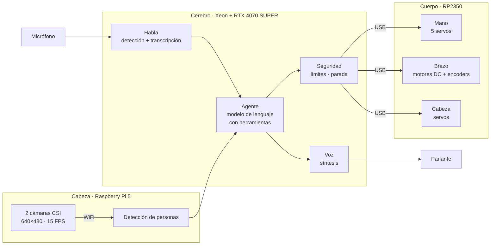
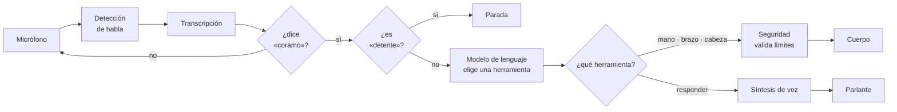

# CORAMO

**CO**laborativo · **R**eprogramable · **A**utónomo · **MO**dular

Robot humanoide modular de tamaño real, controlado por voz. Torso, cabeza con visión estereoscópica, un brazo y una mano de cinco dedos. Proyecto independiente de [Felipe Ballesteros León](https://github.com/FelipeBallesteros0), en Santiago de Chile.

Esta rama contiene **CORAMO v2**, un rediseño desde cero iniciado en septiembre de 2026. La v1 (2026-03 a 2026-05) se conserva íntegra en la rama [`v1-rpi5`](../../tree/v1-rpi5) y el tag [`v1.0`](../../releases/tag/v1.0); su documentación de hardware está en [`docs/legado/`](docs/legado).

## Por qué una v2

La v1 demostró el concepto: voz a acción física, todo local, sobre una Raspberry Pi 5 con dos GPU AMD RX 580 colgadas de un enlace PCIe x1. Funcionaba, pero ese enlace fijaba la latencia en **6 segundos**, de los cuales el 83 % era transcripción. El rediseño parte de un servidor x86 con PCIe real y rehace el software con tests, un protocolo único hacia el hardware y seguridad en el microcontrolador.

## Arquitectura

| Capa | Hardware | Software |
|---|---|---|
| Cerebro | Xeon E5-2697 v2, 64 GB, RTX 4070 SUPER | ROS 2 Lyrical Luth sobre Ubuntu 26.04; voz a acción con tools |
| Cabeza | Raspberry Pi 5 con SSD NVMe y dos cámaras CSI | ROS 2 Lyrical, `camera_ros` a 15 FPS |
| Cuerpo | RP2350 (Pico 2 W) → PCA9685 → BTS7960 y servos | Firmware C++ con watchdog, límites y parada |

### De la voz a la acción

El modelo de lenguaje nunca escribe directo al hardware: solo elige una herramienta de una lista cerrada, y un filtro aparte valida los límites antes de que llegue al microcontrolador. «Detente» se reconoce por texto antes de llamar al modelo, para no gastar medio segundo en la única orden donde importa.

Objetivo medido: **≤ 1,5 s** desde que el usuario deja de hablar hasta que el robot se mueve.

## Estado

Hito 0 (puesta a punto del cerebro y la cabeza) y subproyecto A (de la voz a la acción) terminados y medidos en hardware real.

**Subproyecto A, cadena completa.** Con las 30 órdenes grabadas, reproducidas a ritmo real y con el cuerpo simulado:

| Tramo | p50 | p95 | Meta |
|---|---|---|---|
| Cierre del turno | 0,75 s | 0,79 s | 0,80 s |
| **Del fin del habla al comando validado** | **1,09 s** | **1,27 s** | 1,50 s |
| Hasta pedir la respuesta hablada | 1,21 s | 1,52 s | 1,60 s |

Las 30 órdenes se transcriben, el acierto de herramienta es de 27 sobre 28, el robot no se activa con su propia voz en veinte respuestas largas seguidas, y al tumbar cada servidor por separado lo que no depende de él sigue funcionando. Detalle y errores encontrados en [`docs/mediciones`](docs/mediciones).

**Componentes por separado:**

| Etapa | Resultado |
|---|---|
| Transcripción, local en GPU | 0,16 s, 8,7 % de error de palabra |
| Modelo de lenguaje, local | 0,35 s, 29 de 30 órdenes correctas |
| Síntesis de voz, local | 0,13 s al primer audio |
| Detección de personas | 46 cuadros por segundo |
| Cámaras de la cabeza al cerebro | 15,0 Hz estables sobre WiFi |

Comparado con alternativas en la nube (OpenAI, DeepSeek), lo local resultó entre 2 y 5 veces más rápido en este servidor, así que la nube queda como respaldo de calidad. Detalle en [`docs/mediciones`](docs/mediciones).

## Organización

- [`docs/superpowers/specs`](docs/superpowers/specs) — diseño maestro: decisiones cerradas, alcance, riesgos.
- [`docs/superpowers/plans`](docs/superpowers/plans) — planes de ejecución paso a paso.
- [`docs/instalacion`](docs/instalacion) — cómo quedó montada cada máquina, con las trampas encontradas.
- [`docs/mediciones`](docs/mediciones) — bitácora de números medidos, con fecha y hardware.
- [`head`](head) — nodo de visión: lanzador de cámaras, servicio y migración al SSD.
- [`tools/bench`](tools/bench) — scripts de medición de latencia por componente.
- [`tools`](tools) — medición de la cadena completa y pruebas de aceptación (auto-escucha, recuperación ante caídas).

## Licencia y contacto

Sitio del proyecto: [coramo.cl](https://coramo.cl) · Canal: [ExodiusRobot](https://youtube.com/@ExodiusRobot)
