# Subproyecto A — Cerebro: plan de implementación

> **Para quien ejecute esto:** usa `superpowers:subagent-driven-development` (recomendado) o `superpowers:executing-plans` para ir tarea por tarea. Los pasos usan casillas `- [ ]` para marcar avance.

**Objetivo:** que el robot escuche una orden hablada en español y emita un comando validado hacia el cuerpo, o responda por voz, en menos de 1,5 segundos.

**Arquitectura:** tres servidores de modelo en Python 3.12 (lenguaje, habla, voz) y seis nodos ROS 2 en el Python 3.14 del sistema que solo usan la biblioteca estándar. La lógica vive en módulos puros bajo `coramo_brain/core/`, sin `rclpy`; los nodos son envoltorios delgados. El cuerpo va simulado.

**Herramientas:** ROS 2 Lyrical Luth, Python 3.14 (nodos) y 3.12 (servidores), `uv`, faster-whisper, Kokoro, llama.cpp con CUDA, pytest, systemd.

**Spec:** `docs/superpowers/specs/2026-09-20-subproyecto-a-cerebro-design.md`

```mermaid
flowchart LR
    T1["1 · mensajes"] --> T2["2 · herramientas<br/>y límites"]
    T2 --> T3["3 · seguridad"] --> T4["4 · cuerpo<br/>simulado"]
    T4 --> T5["5 · servidor<br/>de voz"] --> T6["6 · nodo<br/>de voz"]
    T6 --> T7["7 · servidor<br/>de habla"] --> T8["8 · nodo<br/>de habla"]
    T8 --> T9["9 · palabra de<br/>activación"] --> T10["10 · agente"]
    T10 --> T11["11 · supervisor<br/>y latencias"] --> T12["12 · lanzadores<br/>y servicios"]
    T12 --> T13["13 · prueba de<br/>integración"] --> T14["14 · medición<br/>y bitácora"]
    style T4 fill:#1a4d2e,color:#fff
    style T6 fill:#1a4d2e,color:#fff
    style T10 fill:#1a4d2e,color:#fff
    style T14 fill:#4d3319,color:#fff
```



En verde los tres puntos donde el robot gana una capacidad visible: mover algo, hablar, y entender una orden completa.

## Restricciones globales

Se aplican a todas las tareas. Cada una las hereda sin repetirlas.

- **Ningún nodo ROS importa `torch`, `faster_whisper`, `kokoro` ni nada que no esté en la biblioteca estándar de Python 3.14.** Si hace falta una dependencia pesada, va a un servidor de modelo. Único añadido permitido: `requests`, ya instalado en el sistema.
- **La lógica se escribe primero como función pura en `core/`, con su prueba, y solo después se envuelve en un nodo.** Las pruebas de `core/` corren sin ROS, sin GPU y sin micrófono.
- **Prueba antes que código**, en este orden: escribir la prueba que falla, verla fallar, escribir lo mínimo para que pase, verla pasar, commit.
- Workspace en `~/coramo/src`. Compilar siempre con `cd ~/coramo && colcon build --symlink-install` y luego `source install/setup.bash`.
- Entorno ROS ya configurado en `/etc/profile.d/coramo-ros.sh`: `RMW_IMPLEMENTATION=rmw_fastrtps_cpp`, `ROS_DISCOVERY_SERVER=192.168.1.103:11811`, `ROS_DOMAIN_ID=7`.
- Puertos fijos: lenguaje 8080, habla 8091, voz 8092. Todos escuchan solo en `127.0.0.1`.
- **Las latencias se miden desde `speech_end`**, el instante en que el usuario dejó de hablar, nunca desde que un servidor emite su resultado.
- Nombres en español para lo que lee una persona (mensajes, registros, documentación) y en inglés para identificadores de código y nombres de temas ROS, que es como ya está el resto del proyecto.
- Un commit por tarea terminada, en la rama `main` del clon `~/coramo` del Xeon. El `push` a GitHub lo decide Felipe.

---

### Task 1: Workspace y mensajes

**Archivos:**
- Crear: `src/coramo_msgs/package.xml`, `src/coramo_msgs/CMakeLists.txt`
- Crear: `src/coramo_msgs/msg/Transcript.msg`, `BodyCommand.msg`, `Event.msg`, `State.msg`

**Interfaces:**
- Produce: los cuatro tipos de mensaje que usan todas las tareas siguientes. `coramo_msgs/msg/BodyCommand` lo hereda el subproyecto B sin cambios.

- [ ] **Paso 1: Crear el paquete de mensajes**

```bash
mkdir -p ~/coramo/src/coramo_msgs/msg
cat > ~/coramo/src/coramo_msgs/package.xml <<'EOF'
<?xml version="1.0"?>
<package format="3">
  <name>coramo_msgs</name>
  <version>0.1.0</version>
  <description>Mensajes propios de CORAMO: transcripcion, comandos al cuerpo, eventos y estado.</description>
  <maintainer email="felipe1024@gmail.com">Felipe Ballesteros</maintainer>
  <license>MIT</license>
  <buildtool_depend>ament_cmake</buildtool_depend>
  <buildtool_depend>rosidl_default_generators</buildtool_depend>
  <depend>std_msgs</depend>
  <depend>builtin_interfaces</depend>
  <exec_depend>rosidl_default_runtime</exec_depend>
  <member_of_group>rosidl_interface_packages</member_of_group>
  <export><build_type>ament_cmake</build_type></export>
</package>
EOF
cat > ~/coramo/src/coramo_msgs/CMakeLists.txt <<'EOF'
cmake_minimum_required(VERSION 3.8)
project(coramo_msgs)
find_package(ament_cmake REQUIRED)
find_package(rosidl_default_generators REQUIRED)
find_package(std_msgs REQUIRED)
find_package(builtin_interfaces REQUIRED)
rosidl_generate_interfaces(${PROJECT_NAME}
  "msg/Transcript.msg"
  "msg/BodyCommand.msg"
  "msg/Event.msg"
  "msg/State.msg"
  DEPENDENCIES std_msgs builtin_interfaces)
ament_package()
EOF
```

- [ ] **Paso 2: Escribir los cuatro mensajes**

```bash
cd ~/coramo/src/coramo_msgs/msg
cat > Transcript.msg <<'EOF'
std_msgs/Header header
string text
float32 confidence
builtin_interfaces/Time speech_end
string wav_path
EOF
cat > BodyCommand.msg <<'EOF'
string TOOL_HAND=mano
string TOOL_ARM=brazo
string TOOL_HEAD=cabeza
string TOOL_STOP=detener

std_msgs/Header header
string tool
string preset
string[] joint_names
float64[] joint_positions_deg
builtin_interfaces/Time speech_end
EOF
cat > Event.msg <<'EOF'
std_msgs/Header header
string name
string detail
EOF
cat > State.msg <<'EOF'
string IDLE=IDLE
string LISTENING=LISTENING
string THINKING=THINKING
string ACTING=ACTING
string SPEAKING=SPEAKING
string STOPPED=STOPPED

std_msgs/Header header
string state
EOF
```

- [ ] **Paso 3: Preparar el entorno de compilación (dos trampas, encontradas el 2026-09-20)**

La imagen de Ubuntu 26.04 no trae `empy` ni `lark`, que el generador de mensajes de ROS necesita. Y el Python 3.12 que instala `uv` queda primero en el PATH, así que CMake lo elige para compilar aunque no tenga los módulos de ROS; el síntoma es `ModuleNotFoundError: No module named em` aunque `python3 -c "import em"` funcione en la terminal.

```bash
sudo apt-get install -y python3-empy python3-lark
mkdir -p ~/.colcon && cat > ~/.colcon/defaults.yaml <<'EOF'
# Los paquetes de ROS se compilan siempre contra el Python del sistema, no
# contra el 3.12 de uv que queda primero en el PATH.
build:
  cmake-args:
    - -DPython3_EXECUTABLE=/usr/bin/python3
    - -DPYTHON_EXECUTABLE=/usr/bin/python3
EOF
```
Esperado: `python3 -c "import em, lark"` sin error y el archivo de colcon creado. Si ya se intentó compilar antes, borrar `build/` e `install/` para que CMake vuelva a decidir.

- [ ] **Paso 4: Compilar y verificar**

```bash
cd ~/coramo && colcon build --symlink-install --packages-select coramo_msgs 2>&1 | tail -3
source install/setup.bash && ros2 interface show coramo_msgs/msg/BodyCommand
```
Esperado: `Summary: 1 package finished` y la definición completa de `BodyCommand` con sus cuatro constantes.

- [ ] **Paso 5: Commit**

```bash
cd ~/coramo && echo "build/
install/
log/" >> .gitignore && git add src .gitignore && git commit -m "feat(msgs): mensajes propios de CORAMO"
```

---

### Task 2: Herramientas del modelo y límites articulares

**Archivos:**
- Crear: `src/coramo_brain/package.xml`, `setup.py`, `setup.cfg`, `resource/coramo_brain`
- Crear: `src/coramo_brain/coramo_brain/__init__.py`, `core/__init__.py`, `core/tools.py`
- Crear: `src/coramo_description/config/joints.yaml`
- Crear: `src/coramo_brain/test/test_tools.py`

**Interfaces:**
- Consume: nada.
- Produce: `core.tools.TOOLS` (esquema JSON para el modelo), `core.tools.cargar_limites(path) -> dict[str, tuple[float, float]]`, `core.tools.a_comando(nombre, args) -> dict` que convierte la salida del modelo en los campos de `BodyCommand`.

- [ ] **Paso 1: Crear el paquete Python y los límites provisionales**

```bash
mkdir -p ~/coramo/src/coramo_brain/coramo_brain/core ~/coramo/src/coramo_brain/test ~/coramo/src/coramo_brain/resource ~/coramo/src/coramo_description/config
touch ~/coramo/src/coramo_brain/resource/coramo_brain ~/coramo/src/coramo_brain/coramo_brain/__init__.py ~/coramo/src/coramo_brain/coramo_brain/core/__init__.py
cat > ~/coramo/src/coramo_description/config/joints.yaml <<'EOF'
# Limites articulares en grados. Provisionales para la mano y la cabeza;
# el brazo los fija el subproyecto C tras el inventario del hardware.
articulaciones:
  pulgar:   {min: 0, max: 180}
  indice:   {min: 0, max: 180}
  medio:    {min: 0, max: 180}
  anular:   {min: 0, max: 180}
  menique:  {min: 0, max: 180}
  cuello_pan:  {min: -80, max: 80}
  cuello_tilt: {min: -30, max: 40}
gestos_mano:
  abre:   {pulgar: 0,   indice: 0,   medio: 0,   anular: 0,   menique: 0}
  cierra: {pulgar: 180, indice: 180, medio: 180, anular: 180, menique: 180}
  paz:    {pulgar: 180, indice: 0,   medio: 0,   anular: 180, menique: 180}
  ok:     {pulgar: 140, indice: 140, medio: 0,   anular: 0,   menique: 0}
  rock:   {pulgar: 180, indice: 0,   medio: 180, anular: 180, menique: 0}
  pulgar: {pulgar: 0,   indice: 180, medio: 180, anular: 180, menique: 180}
poses_cabeza:
  frente:    {cuello_pan: 0,   cuello_tilt: 0}
  izquierda: {cuello_pan: 60,  cuello_tilt: 0}
  derecha:   {cuello_pan: -60, cuello_tilt: 0}
  arriba:    {cuello_pan: 0,   cuello_tilt: 35}
  abajo:     {cuello_pan: 0,   cuello_tilt: -25}
EOF
```

- [ ] **Paso 2: Escribir la prueba que falla**

```python
# src/coramo_brain/test/test_tools.py
import pytest
from coramo_brain.core import tools

RUTA = "src/coramo_description/config/joints.yaml"


def test_hay_cinco_herramientas():
    nombres = {t["function"]["name"] for t in tools.TOOLS}
    assert nombres == {"mano", "brazo", "cabeza", "responder", "detener"}


def test_gesto_cierra_se_traduce_a_cinco_dedos():
    cmd = tools.a_comando("mano", {"gesto": "cierra"}, tools.cargar_limites(RUTA))
    assert cmd["tool"] == "mano"
    assert cmd["preset"] == "cierra"
    assert len(cmd["joint_names"]) == 5
    assert all(v == 180 for v in cmd["joint_positions_deg"])


def test_gesto_desconocido_se_rechaza():
    with pytest.raises(tools.ComandoInvalido):
        tools.a_comando("mano", {"gesto": "saludo_vulcano"}, tools.cargar_limites(RUTA))


def test_angulo_fuera_de_limite_se_rechaza():
    with pytest.raises(tools.ComandoInvalido):
        tools.a_comando("cabeza", {"articulaciones": {"cuello_pan": 200}}, tools.cargar_limites(RUTA))


def test_articulacion_inexistente_se_rechaza():
    with pytest.raises(tools.ComandoInvalido):
        tools.a_comando("mano", {"dedos": {"tentaculo": 90}}, tools.cargar_limites(RUTA))
```

- [ ] **Paso 3: Verla fallar**

```bash
cd ~/coramo && python3 -m pytest src/coramo_brain/test/test_tools.py -q 2>&1 | tail -3
```
Esperado: error de importación, `No module named 'coramo_brain'`.

- [ ] **Paso 4: Escribir `core/tools.py`**

```python
# src/coramo_brain/coramo_brain/core/tools.py
"""Herramientas que el modelo de lenguaje puede elegir, y su traduccion a comandos.

Este modulo es la fuente unica de la verdad sobre que puede pedir el modelo.
No importa rclpy: se prueba solo.
"""
from __future__ import annotations
import json
from pathlib import Path


class ComandoInvalido(Exception):
    """La orden del modelo no se puede convertir en un comando seguro."""


GESTOS = ["abre", "cierra", "paz", "ok", "rock", "pulgar"]
POSES_BRAZO = ["reposo", "saludo", "extendido", "arriba", "abajo"]
MIRADAS = ["frente", "izquierda", "derecha", "arriba", "abajo"]

TOOLS = [
    {"type": "function", "function": {
        "name": "mano",
        "description": "Mueve la mano robotica: un gesto completo o dedos individuales en grados.",
        "parameters": {"type": "object", "properties": {
            "gesto": {"type": "string", "enum": GESTOS},
            "dedos": {"type": "object", "additionalProperties": {"type": "number"}}},
            "additionalProperties": False}}},
    {"type": "function", "function": {
        "name": "brazo",
        "description": "Mueve el brazo a una pose nombrada o a angulos articulares en grados.",
        "parameters": {"type": "object", "properties": {
            "pose": {"type": "string", "enum": POSES_BRAZO},
            "articulaciones": {"type": "object", "additionalProperties": {"type": "number"}}},
            "additionalProperties": False}}},
    {"type": "function", "function": {
        "name": "cabeza",
        "description": "Orienta la cabeza del robot.",
        "parameters": {"type": "object", "properties": {
            "mirar": {"type": "string", "enum": MIRADAS},
            "articulaciones": {"type": "object", "additionalProperties": {"type": "number"}}},
            "additionalProperties": False}}},
    {"type": "function", "function": {
        "name": "responder",
        "description": "Responde por voz cuando no hay accion fisica.",
        "parameters": {"type": "object", "properties": {"texto": {"type": "string"}},
                       "required": ["texto"], "additionalProperties": False}}},
    {"type": "function", "function": {
        "name": "detener",
        "description": "Parada inmediata de todos los motores.",
        "parameters": {"type": "object", "properties": {}, "additionalProperties": False}}},
]


def cargar_limites(ruta: str | Path) -> dict:
    """Lee joints.yaml sin depender de PyYAML: el formato es plano y conocido."""
    datos = {"articulaciones": {}, "gestos_mano": {}, "poses_cabeza": {}}
    seccion = None
    for linea in Path(ruta).read_text(encoding="utf-8").splitlines():
        sin_comentario = linea.split("#", 1)[0].rstrip()
        if not sin_comentario:
            continue
        if not sin_comentario.startswith(" "):
            seccion = sin_comentario.rstrip(":")
            continue
        clave, _, resto = sin_comentario.strip().partition(":")
        cuerpo = resto.strip().strip("{}")
        valores = {}
        for par in cuerpo.split(","):
            k, _, v = par.partition(":")
            if k.strip():
                valores[k.strip()] = float(v.strip())
        if seccion == "articulaciones":
            datos["articulaciones"][clave] = (valores["min"], valores["max"])
        elif seccion in ("gestos_mano", "poses_cabeza"):
            datos[seccion][clave] = valores
    return datos


def _validar_angulos(angulos: dict, limites: dict) -> None:
    for nombre, grados in angulos.items():
        if nombre not in limites["articulaciones"]:
            raise ComandoInvalido(f"articulacion desconocida: {nombre}")
        bajo, alto = limites["articulaciones"][nombre]
        if not bajo <= grados <= alto:
            raise ComandoInvalido(f"{nombre}={grados} fuera de [{bajo}, {alto}]")


def a_comando(nombre: str, args: dict, limites: dict) -> dict:
    """Convierte la eleccion del modelo en los campos de BodyCommand.

    Lanza ComandoInvalido si algo no encaja. Nunca recorta en silencio.
    """
    if nombre == "detener":
        return {"tool": "detener", "preset": "", "joint_names": [], "joint_positions_deg": []}

    if nombre == "mano":
        if "gesto" in args:
            gesto = args["gesto"]
            if gesto not in limites["gestos_mano"]:
                raise ComandoInvalido(f"gesto desconocido: {gesto}")
            angulos = limites["gestos_mano"][gesto]
            preset = gesto
        elif "dedos" in args:
            angulos, preset = dict(args["dedos"]), ""
        else:
            raise ComandoInvalido("mano sin gesto ni dedos")
    elif nombre == "cabeza":
        if "mirar" in args:
            mirada = args["mirar"]
            if mirada not in limites["poses_cabeza"]:
                raise ComandoInvalido(f"mirada desconocida: {mirada}")
            angulos, preset = limites["poses_cabeza"][mirada], mirada
        elif "articulaciones" in args:
            angulos, preset = dict(args["articulaciones"]), ""
        else:
            raise ComandoInvalido("cabeza sin mirar ni articulaciones")
    elif nombre == "brazo":
        if "pose" in args:
            if args["pose"] not in POSES_BRAZO:
                raise ComandoInvalido(f"pose desconocida: {args['pose']}")
            # Las poses del brazo las define el subproyecto C tras el inventario.
            return {"tool": "brazo", "preset": args["pose"], "joint_names": [], "joint_positions_deg": []}
        if "articulaciones" not in args:
            raise ComandoInvalido("brazo sin pose ni articulaciones")
        angulos, preset = dict(args["articulaciones"]), ""
    else:
        raise ComandoInvalido(f"herramienta desconocida: {nombre}")

    _validar_angulos(angulos, limites)
    nombres = sorted(angulos)
    return {"tool": nombre, "preset": preset,
            "joint_names": nombres,
            "joint_positions_deg": [float(angulos[n]) for n in nombres]}
```

- [ ] **Paso 5: Completar el paquete y verla pasar**

```bash
cat > ~/coramo/src/coramo_brain/setup.py <<'EOF'
from setuptools import find_packages, setup
setup(
    name="coramo_brain", version="0.1.0",
    packages=find_packages(exclude=["test"]),
    data_files=[("share/ament_index/resource_index/packages", ["resource/coramo_brain"]),
                ("share/coramo_brain", ["package.xml"])],
    install_requires=["setuptools"], zip_safe=True,
    maintainer="Felipe Ballesteros", maintainer_email="felipe1024@gmail.com",
    description="Cerebro de CORAMO: voz a accion.", license="MIT",
    entry_points={"console_scripts": []},
)
EOF
cat > ~/coramo/src/coramo_brain/package.xml <<'EOF'
<?xml version="1.0"?>
<package format="3">
  <name>coramo_brain</name>
  <version>0.1.0</version>
  <description>Cerebro de CORAMO: voz a accion.</description>
  <maintainer email="felipe1024@gmail.com">Felipe Ballesteros</maintainer>
  <license>MIT</license>
  <depend>rclpy</depend>
  <depend>std_msgs</depend>
  <depend>std_srvs</depend>
  <depend>sensor_msgs</depend>
  <depend>coramo_msgs</depend>
  <test_depend>ament_copyright</test_depend>
  <test_depend>python3-pytest</test_depend>
  <export><build_type>ament_python</build_type></export>
</package>
EOF
printf '[develop]\nscript_dir=$base/lib/coramo_brain\n[install]\ninstall_scripts=$base/lib/coramo_brain\n' > ~/coramo/src/coramo_brain/setup.cfg
cd ~/coramo && PYTHONPATH=src/coramo_brain python3 -m pytest src/coramo_brain/test/test_tools.py -q 2>&1 | tail -3
```
Esperado: `5 passed`.

- [ ] **Paso 6: Commit**

```bash
cd ~/coramo && git add src && git commit -m "feat(brain): herramientas del modelo y limites articulares, con pruebas"
```

---

### Task 3: Filtro de seguridad

**Archivos:**
- Crear: `src/coramo_brain/coramo_brain/core/safety.py`
- Crear: `src/coramo_brain/coramo_brain/nodes/__init__.py`, `nodes/safety_node.py`
- Crear: `src/coramo_brain/test/test_safety.py`
- Modificar: `src/coramo_brain/setup.py` (registrar el ejecutable)

**Interfaces:**
- Consume: `core.tools.cargar_limites`, `ComandoInvalido`.
- Produce: `core.safety.Filtro` con `revisar(cmd, ahora) -> (bool, str)` y `estado` (`activo` o `detenido`). El nodo publica `/body/command_safe` y ofrece el servicio `/body/estop`.

- [ ] **Paso 1: Escribir la prueba que falla**

```python
# src/coramo_brain/test/test_safety.py
import pytest
from coramo_brain.core import safety, tools

LIM = tools.cargar_limites("src/coramo_description/config/joints.yaml")


def cmd(**kw):
    base = {"tool": "mano", "preset": "cierra",
            "joint_names": ["indice"], "joint_positions_deg": [90.0]}
    base.update(kw)
    return base


def test_comando_valido_pasa():
    f = safety.Filtro(LIM)
    ok, razon = f.revisar(cmd(), ahora=1.0)
    assert ok and razon == ""


def test_angulo_fuera_de_limite_se_rechaza():
    f = safety.Filtro(LIM)
    ok, razon = f.revisar(cmd(joint_positions_deg=[500.0]), ahora=1.0)
    assert not ok and "fuera" in razon


def test_dos_comandos_muy_seguidos_se_rechaza_el_segundo():
    f = safety.Filtro(LIM)
    assert f.revisar(cmd(), ahora=1.00)[0] is True
    ok, razon = f.revisar(cmd(), ahora=1.05)
    assert not ok and "seguidos" in razon


def test_tras_parar_no_pasa_nada_hasta_rearmar():
    f = safety.Filtro(LIM)
    f.parar()
    assert f.revisar(cmd(), ahora=2.0)[0] is False
    f.rearmar()
    assert f.revisar(cmd(), ahora=3.0)[0] is True


def test_la_parada_siempre_pasa():
    f = safety.Filtro(LIM)
    f.parar()
    ok, _ = f.revisar(cmd(tool="detener", joint_names=[], joint_positions_deg=[]), ahora=2.0)
    assert ok
```

- [ ] **Paso 2: Verla fallar**

```bash
cd ~/coramo && PYTHONPATH=src/coramo_brain python3 -m pytest src/coramo_brain/test/test_safety.py -q 2>&1 | tail -3
```
Esperado: `ModuleNotFoundError: No module named 'coramo_brain.core.safety'`.

- [ ] **Paso 3: Escribir `core/safety.py`**

```python
# src/coramo_brain/coramo_brain/core/safety.py
"""Filtro entre la decision del modelo y el cuerpo.

Rechaza, nunca recorta: un recorte silencioso convierte una orden mal entendida
en un movimiento inesperado cerca de una persona.
"""
from __future__ import annotations

SEPARACION_MINIMA_S = 0.10


class Filtro:
    def __init__(self, limites: dict, separacion_minima_s: float = SEPARACION_MINIMA_S):
        self._limites = limites
        self._separacion = separacion_minima_s
        self._ultimo = None
        self.detenido = False

    def parar(self) -> None:
        self.detenido = True

    def rearmar(self) -> None:
        self.detenido = False
        self._ultimo = None

    def revisar(self, cmd: dict, ahora: float) -> tuple[bool, str]:
        if cmd.get("tool") == "detener":
            self.parar()
            return True, ""
        if self.detenido:
            return False, "el robot esta detenido; hace falta rearmarlo"
        if self._ultimo is not None and ahora - self._ultimo < self._separacion:
            return False, "dos comandos demasiado seguidos"

        nombres = cmd.get("joint_names") or []
        grados = cmd.get("joint_positions_deg") or []
        if len(nombres) != len(grados):
            return False, "la lista de articulaciones y la de angulos no coinciden"
        for nombre, valor in zip(nombres, grados):
            if nombre not in self._limites["articulaciones"]:
                return False, f"articulacion desconocida: {nombre}"
            bajo, alto = self._limites["articulaciones"][nombre]
            if not bajo <= valor <= alto:
                return False, f"{nombre}={valor} fuera de [{bajo}, {alto}]"

        self._ultimo = ahora
        return True, ""
```

- [ ] **Paso 4: Verla pasar**

```bash
cd ~/coramo && PYTHONPATH=src/coramo_brain python3 -m pytest src/coramo_brain/test/test_safety.py -q 2>&1 | tail -3
```
Esperado: `5 passed`.

- [ ] **Paso 5: Escribir el nodo**

```python
# src/coramo_brain/coramo_brain/nodes/safety_node.py
"""Nodo delgado: escucha /body/command, publica /body/command_safe."""
import rclpy
from rclpy.node import Node
from std_srvs.srv import Trigger
from coramo_msgs.msg import BodyCommand, Event
from coramo_brain.core import safety, tools


class SafetyNode(Node):
    def __init__(self):
        super().__init__("safety")
        self.declare_parameter("joints_yaml", "")
        ruta = self.get_parameter("joints_yaml").value
        self._filtro = safety.Filtro(tools.cargar_limites(ruta))
        self._pub = self.create_publisher(BodyCommand, "/body/command_safe", 10)
        self._ev = self.create_publisher(Event, "/coramo/event", 10)
        self.create_subscription(BodyCommand, "/body/command", self._al_llegar, 10)
        self.create_service(Trigger, "/body/estop", self._parar)
        self.create_service(Trigger, "/body/rearm", self._rearmar)
        self.get_logger().info(f"seguridad lista, limites de {ruta}")

    def _evento(self, nombre: str, detalle: str = "") -> None:
        msg = Event()
        msg.header.stamp = self.get_clock().now().to_msg()
        msg.name, msg.detail = nombre, detalle
        self._ev.publish(msg)

    def _al_llegar(self, msg: BodyCommand) -> None:
        ahora = self.get_clock().now().nanoseconds / 1e9
        cmd = {"tool": msg.tool, "preset": msg.preset,
               "joint_names": list(msg.joint_names),
               "joint_positions_deg": list(msg.joint_positions_deg)}
        ok, razon = self._filtro.revisar(cmd, ahora)
        if ok:
            self._pub.publish(msg)
            self._evento("command_sent", msg.tool)
        else:
            self.get_logger().warning(f"comando rechazado: {razon}")
            self._evento("command_rejected", razon)

    def _parar(self, _req, resp):
        self._filtro.parar()
        self._evento("estop")
        resp.success, resp.message = True, "detenido"
        return resp

    def _rearmar(self, _req, resp):
        self._filtro.rearmar()
        self._evento("rearm")
        resp.success, resp.message = True, "rearmado"
        return resp


def main():
    rclpy.init()
    nodo = SafetyNode()
    try:
        rclpy.spin(nodo)
    except KeyboardInterrupt:
        pass
    finally:
        nodo.destroy_node()
        rclpy.try_shutdown()
```

- [ ] **Paso 6: Registrar el ejecutable, compilar y probar a mano**

```bash
cd ~/coramo && sed -i 's|"console_scripts": \[\]|"console_scripts": ["safety = coramo_brain.nodes.safety_node:main"]|' src/coramo_brain/setup.py
mkdir -p src/coramo_brain/coramo_brain/nodes && touch src/coramo_brain/coramo_brain/nodes/__init__.py
colcon build --symlink-install --packages-select coramo_brain 2>&1 | tail -2 && source install/setup.bash
(ros2 run coramo_brain safety --ros-args -p joints_yaml:=$HOME/coramo/src/coramo_description/config/joints.yaml &) ; sleep 3
ros2 topic pub --once /body/command coramo_msgs/msg/BodyCommand '{tool: mano, preset: cierra, joint_names: [indice], joint_positions_deg: [90.0]}' >/dev/null
timeout 5 ros2 topic echo /body/command_safe --once
ros2 topic pub --once /body/command coramo_msgs/msg/BodyCommand '{tool: mano, joint_names: [indice], joint_positions_deg: [500.0]}' >/dev/null
timeout 5 ros2 topic echo /coramo/event --once
pkill -f "[c]oramo_brain.nodes.safety_node"
```
Esperado: el primer comando aparece en `/body/command_safe`; el segundo no, y en `/coramo/event` sale `command_rejected` con la razón.

- [ ] **Paso 7: Commit**

```bash
cd ~/coramo && git add src && git commit -m "feat(safety): filtro de limites, parada y rearme, con nodo y pruebas"
```

---

### Task 4: Cuerpo simulado

**Archivos:**
- Crear: `src/coramo_brain/coramo_brain/nodes/body_bridge_sim_node.py`
- Modificar: `src/coramo_brain/setup.py`

**Interfaces:**
- Consume: `/body/command_safe`.
- Produce: `/joint_states` (`sensor_msgs/JointState`) con la última posición ordenada, a 20 Hz. El subproyecto B lo reemplaza por el puente real sin que cambie nada aguas arriba.

- [ ] **Paso 1: Escribir el nodo**

```python
# src/coramo_brain/coramo_brain/nodes/body_bridge_sim_node.py
"""Cuerpo simulado: acepta comandos y publica las articulaciones como si se movieran.

Permite desarrollar y medir el cerebro completo sin hardware. El subproyecto B
lo sustituye por el puente real al Pico, con la misma entrada.
"""
import math
import rclpy
from rclpy.node import Node
from sensor_msgs.msg import JointState
from coramo_msgs.msg import BodyCommand


class BodyBridgeSim(Node):
    def __init__(self):
        super().__init__("body_bridge")
        self.declare_parameter("velocidad_grados_por_s", 180.0)
        self._vel = float(self.get_parameter("velocidad_grados_por_s").value)
        self._actual: dict[str, float] = {}
        self._objetivo: dict[str, float] = {}
        self._pub = self.create_publisher(JointState, "/joint_states", 10)
        self.create_subscription(BodyCommand, "/body/command_safe", self._al_llegar, 10)
        self._t = self.get_clock().now().nanoseconds / 1e9
        self.create_timer(0.05, self._tick)
        self.get_logger().info("cuerpo SIMULADO listo")

    def _al_llegar(self, msg: BodyCommand) -> None:
        if msg.tool == "detener":
            self._objetivo = dict(self._actual)
            self.get_logger().info("parada: se congela la posicion")
            return
        for nombre, grados in zip(msg.joint_names, msg.joint_positions_deg):
            self._objetivo[nombre] = float(grados)
            self._actual.setdefault(nombre, 0.0)

    def _tick(self) -> None:
        ahora = self.get_clock().now().nanoseconds / 1e9
        paso = self._vel * (ahora - self._t)
        self._t = ahora
        for nombre, destino in self._objetivo.items():
            actual = self._actual.get(nombre, 0.0)
            if abs(destino - actual) <= paso:
                self._actual[nombre] = destino
            else:
                self._actual[nombre] = actual + math.copysign(paso, destino - actual)
        if not self._actual:
            return
        msg = JointState()
        msg.header.stamp = self.get_clock().now().to_msg()
        msg.name = sorted(self._actual)
        msg.position = [math.radians(self._actual[n]) for n in msg.name]
        self._pub.publish(msg)


def main():
    rclpy.init()
    nodo = BodyBridgeSim()
    try:
        rclpy.spin(nodo)
    except KeyboardInterrupt:
        pass
    finally:
        nodo.destroy_node()
        rclpy.try_shutdown()
```

- [ ] **Paso 2: Registrar, compilar y comprobar el movimiento**

```bash
cd ~/coramo && sed -i 's|"safety = coramo_brain.nodes.safety_node:main"|"safety = coramo_brain.nodes.safety_node:main", "body_bridge_sim = coramo_brain.nodes.body_bridge_sim_node:main"|' src/coramo_brain/setup.py
colcon build --symlink-install --packages-select coramo_brain 2>&1 | tail -2 && source install/setup.bash
(ros2 run coramo_brain body_bridge_sim &) ; sleep 3
ros2 topic pub --once /body/command_safe coramo_msgs/msg/BodyCommand '{tool: mano, preset: cierra, joint_names: [indice, medio], joint_positions_deg: [180.0, 180.0]}' >/dev/null
sleep 2; timeout 5 ros2 topic echo /joint_states --once
pkill -f "[b]ody_bridge_sim_node"
```
Esperado: `/joint_states` con `indice` y `medio` en 3,14 radianes, que son los 180 grados pedidos.

- [ ] **Paso 3: Commit**

```bash
cd ~/coramo && git add src && git commit -m "feat(body): puente simulado que mueve articulaciones a velocidad finita"
```

---

### Task 5: Servidor de voz

**Archivos:**
- Crear: `servers/voice/app.py`, `servers/voice/requirements.txt`
- Crear: `servers/voice/coramo-voice.service`

**Interfaces:**
- Produce: `POST /say {"texto": str}` que sintetiza y reproduce, devolviendo `{"t_first_audio": float, "t_done": float}`; `GET /health`. Puerto 8092.

- [ ] **Paso 1: Escribir el servidor**

```python
# servers/voice/app.py
"""Servidor de voz de CORAMO. Corre en ~/venvs/tts con Python 3.12.

Sintetiza por frases y reproduce por el parlante. Devuelve cuando sono el primer
audio, que es lo que percibe la persona, y cuando termino.
"""
import io
import subprocess
import time
import wave

import numpy as np
from fastapi import FastAPI
from kokoro import KPipeline
from pydantic import BaseModel

VOZ = "ef_dora"
FRECUENCIA = 24000
DISPOSITIVO = "default"

app = FastAPI()
pipe = KPipeline(lang_code="e", device="cuda")


class Peticion(BaseModel):
    texto: str
    voz: str = VOZ


def _reproducir(audio: np.ndarray) -> None:
    """Reproduce por el parlante. Lanza si no suena, en vez de callarlo.

    Bajo systemd hace falta XDG_RUNTIME_DIR para alcanzar PipeWire; sin el,
    aplay responde "Host is down" y el robot parece hablar sin que suene nada.
    """
    buf = io.BytesIO()
    with wave.open(buf, "wb") as w:
        w.setnchannels(1)
        w.setsampwidth(2)
        w.setframerate(FRECUENCIA)
        w.writeframes((np.clip(audio, -1, 1) * 32767).astype("<i2").tobytes())
    r = subprocess.run(["aplay", "-q", "-D", DISPOSITIVO, "-"],
                       input=buf.getvalue(), capture_output=True)
    if r.returncode != 0:
        raise RuntimeError(f"no se pudo reproducir: {r.stderr.decode().strip()[:120]}")


@app.on_event("startup")
def calentar() -> None:
    """Sintetiza una frase corta sin reproducirla.

    Sin esto la primera peticion real tarda 1,8 s en vez de 0,13 s, porque el
    modelo carga la voz la primera vez. Medido el 2026-09-20.
    """
    for _gs, _ps, _audio in pipe("listo", voice=VOZ):
        break


@app.get("/health")
def health():
    return {"ok": True, "voz": VOZ, "motor": "kokoro"}


@app.post("/say")
def say(p: Peticion):
    t0 = time.time()
    primero = None
    for _gs, _ps, audio in pipe(p.texto, voice=p.voz):
        if primero is None:
            primero = time.time()
        _reproducir(np.asarray(audio))
    if primero is None:
        return {"error": "sin audio", "t_first_audio": None, "t_done": time.time()}
    return {"t_first_audio": primero, "t_done": time.time(), "t_recibido": t0}
```

- [ ] **Paso 2: Instalar dependencias y probar a mano**

```bash
ssh coramo 'export PATH=$HOME/.local/bin:$PATH; uv pip install --python ~/venvs/tts/bin/python -q fastapi uvicorn
mkdir -p ~/coramo/servers/voice'
scp ~/coramo/servers/voice/app.py coramo:~/coramo/servers/voice/
ssh coramo '(cd ~/coramo/servers/voice && nohup ~/venvs/tts/bin/python -m uvicorn app:app --host 127.0.0.1 --port 8092 > /tmp/voice.log 2>&1 &); sleep 25
curl -s http://127.0.0.1:8092/health
curl -s -X POST http://127.0.0.1:8092/say -H "Content-Type: application/json" -d "{\"texto\":\"Hola, soy CORAMO\"}"'
```
Esperado: el `health` responde con `"ok": true`, se oye la frase por el parlante, y el `say` devuelve las dos marcas de tiempo. La diferencia entre `t_first_audio` y `t_recibido` debe rondar 0,15 s.

- [ ] **Paso 3: Dejarlo como servicio**

```bash
ssh coramo 'printf "[Unit]\nDescription=CORAMO servidor de voz\nAfter=network.target\n\n[Service]\nUser=coramo\nEnvironment=XDG_RUNTIME_DIR=/run/user/1000\nWorkingDirectory=/home/coramo/coramo/servers/voice\nExecStart=/home/coramo/venvs/tts/bin/python -m uvicorn app:app --host 127.0.0.1 --port 8092\nRestart=always\nRestartSec=5\n\n[Install]\nWantedBy=multi-user.target\n" > /tmp/v.service
echo coramo123 | sudo -S -p "" install -m 644 /tmp/v.service /etc/systemd/system/coramo-voice.service
pkill -f "uvicorn app:app --host 127.0.0.1 --port 8092"
echo coramo123 | sudo -S -p "" systemctl daemon-reload
echo coramo123 | sudo -S -p "" systemctl enable --now coramo-voice; sleep 25
systemctl is-active coramo-voice; curl -s http://127.0.0.1:8092/health'
```
Esperado: `active` y el `health` responde.

- [ ] **Paso 4: Commit**

```bash
cd ~/coramo && git add servers && git commit -m "feat(voice): servidor de sintesis con medicion de primer audio"
```

---

### Task 6: Nodo de voz

**Archivos:**
- Crear: `src/coramo_brain/coramo_brain/core/voice_client.py`, `nodes/tts_node.py`
- Crear: `src/coramo_brain/test/test_voice_client.py`
- Modificar: `setup.py`

**Interfaces:**
- Consume: `/tts/say` (`std_msgs/String`).
- Produce: eventos `tts_first_audio` y `tts_done`. Silencia el micrófono llamando a `POST /mute` del servidor de habla mientras dura, y lo reactiva al terminar; si ese servidor no existe todavía, lo registra y sigue.

- [ ] **Paso 1: Escribir la prueba con un servidor falso**

```python
# src/coramo_brain/test/test_voice_client.py
import json
import threading
from http.server import BaseHTTPRequestHandler, HTTPServer

from coramo_brain.core import voice_client

LLAMADAS = []


class Falso(BaseHTTPRequestHandler):
    def do_POST(self):
        LLAMADAS.append(self.path)
        n = int(self.headers.get("Content-Length", 0))
        self.rfile.read(n)
        cuerpo = json.dumps({"t_first_audio": 100.5, "t_done": 101.2}).encode()
        self.send_response(200)
        self.send_header("Content-Type", "application/json")
        self.send_header("Content-Length", str(len(cuerpo)))
        self.end_headers()
        self.wfile.write(cuerpo)

    def log_message(self, *_a):
        pass


def _servidor():
    s = HTTPServer(("127.0.0.1", 0), Falso)
    threading.Thread(target=s.serve_forever, daemon=True).start()
    return s


def test_decir_devuelve_las_marcas_y_silencia_el_microfono():
    LLAMADAS.clear()
    s = _servidor()
    url = f"http://127.0.0.1:{s.server_port}"
    cli = voice_client.Voz(url_voz=url, url_habla=url, timeout_s=5)
    r = cli.decir("hola")
    assert r["t_first_audio"] == 100.5
    assert "/mute" in LLAMADAS and "/say" in LLAMADAS and "/unmute" in LLAMADAS
    assert LLAMADAS.index("/mute") < LLAMADAS.index("/say") < LLAMADAS.index("/unmute")


def test_si_el_servidor_de_habla_no_esta_igual_habla():
    LLAMADAS.clear()
    s = _servidor()
    cli = voice_client.Voz(url_voz=f"http://127.0.0.1:{s.server_port}",
                           url_habla="http://127.0.0.1:1", timeout_s=2)
    r = cli.decir("hola")
    assert r["t_first_audio"] == 100.5
```

- [ ] **Paso 2: Verla fallar, escribir el cliente, verla pasar**

```python
# src/coramo_brain/coramo_brain/core/voice_client.py
"""Cliente del servidor de voz. Solo biblioteca estandar: corre en Python 3.14."""
from __future__ import annotations
import json
import urllib.error
import urllib.request


class Voz:
    def __init__(self, url_voz: str, url_habla: str, timeout_s: float = 30.0):
        self._voz = url_voz.rstrip("/")
        self._habla = url_habla.rstrip("/")
        self._timeout = timeout_s

    def _post(self, url: str, datos: dict | None, timeout: float) -> dict:
        cuerpo = json.dumps(datos or {}).encode()
        req = urllib.request.Request(url, data=cuerpo, method="POST",
                                     headers={"Content-Type": "application/json"})
        with urllib.request.urlopen(req, timeout=timeout) as r:
            return json.loads(r.read() or b"{}")

    def _silenciar(self, activar: bool) -> None:
        """Best effort: si el servidor de habla no esta, no impide hablar."""
        try:
            self._post(f"{self._habla}/{'mute' if activar else 'unmute'}", {}, 2.0)
        except (urllib.error.URLError, OSError, TimeoutError):
            pass

    def decir(self, texto: str) -> dict:
        self._silenciar(True)
        try:
            return self._post(f"{self._voz}/say", {"texto": texto}, self._timeout)
        finally:
            self._silenciar(False)
```

```bash
cd ~/coramo && PYTHONPATH=src/coramo_brain python3 -m pytest src/coramo_brain/test/test_voice_client.py -q 2>&1 | tail -3
```
Esperado: `2 passed`.

- [ ] **Paso 3: Escribir el nodo**

```python
# src/coramo_brain/coramo_brain/nodes/tts_node.py
"""Nodo delgado: escucha /tts/say y hace hablar al robot."""
import threading
import rclpy
from rclpy.node import Node
from std_msgs.msg import String
from coramo_msgs.msg import Event
from coramo_brain.core.voice_client import Voz


class TtsNode(Node):
    def __init__(self):
        super().__init__("tts")
        self.declare_parameter("url_voz", "http://127.0.0.1:8092")
        self.declare_parameter("url_habla", "http://127.0.0.1:8091")
        self._voz = Voz(self.get_parameter("url_voz").value,
                        self.get_parameter("url_habla").value)
        self._ev = self.create_publisher(Event, "/coramo/event", 10)
        self.create_subscription(String, "/tts/say", self._al_llegar, 10)
        self._ocupado = threading.Lock()
        self.get_logger().info("voz lista")

    def _evento(self, nombre: str, detalle: str = "") -> None:
        msg = Event()
        msg.header.stamp = self.get_clock().now().to_msg()
        msg.name, msg.detail = nombre, detalle
        self._ev.publish(msg)

    def _al_llegar(self, msg: String) -> None:
        threading.Thread(target=self._hablar, args=(msg.data,), daemon=True).start()

    def _hablar(self, texto: str) -> None:
        if not self._ocupado.acquire(blocking=False):
            self.get_logger().warning("ya esta hablando; se descarta la frase nueva")
            return
        try:
            r = self._voz.decir(texto)
            if r.get("t_first_audio"):
                self._evento("tts_first_audio", texto[:40])
            self._evento("tts_done")
        except Exception as e:
            self.get_logger().error(f"no se pudo hablar: {e}")
            self._evento("error", f"tts: {e}")
        finally:
            self._ocupado.release()


def main():
    rclpy.init()
    nodo = TtsNode()
    try:
        rclpy.spin(nodo)
    except KeyboardInterrupt:
        pass
    finally:
        nodo.destroy_node()
        rclpy.try_shutdown()
```

- [ ] **Paso 4: Registrar, compilar y comprobar que suena**

```bash
cd ~/coramo && sed -i 's|"body_bridge_sim = coramo_brain.nodes.body_bridge_sim_node:main"|"body_bridge_sim = coramo_brain.nodes.body_bridge_sim_node:main", "tts = coramo_brain.nodes.tts_node:main"|' src/coramo_brain/setup.py
colcon build --symlink-install --packages-select coramo_brain 2>&1 | tail -2 && source install/setup.bash
(ros2 run coramo_brain tts &) ; sleep 3
ros2 topic pub --once /tts/say std_msgs/msg/String '{data: "Hola, soy CORAMO y ya puedo hablar"}' >/dev/null
timeout 10 ros2 topic echo /coramo/event --once
pkill -f "[t]ts_node"
```
Esperado: se oye la frase y el primer evento es `tts_first_audio`.

- [ ] **Paso 5: Commit**

```bash
cd ~/coramo && git add src && git commit -m "feat(tts): nodo de voz que silencia el microfono mientras habla"
```

---

### Task 7: Servidor de habla

**Archivos:**
- Crear: `servers/speech/app.py`, `servers/speech/coramo-speech.service`

**Interfaces:**
- Produce: `GET /events` (flujo de eventos), `POST /mute`, `POST /unmute`, `GET /health`. Puerto 8091. Guarda el audio de cada turno en `~/datos/sesiones/<fecha>/<hora>.wav`.
- Parámetro `fuente`: `mic` para el micrófono o una ruta de carpeta con WAV, que es lo que permite probar sin micrófono.

- [ ] **Paso 1: Escribir el servidor**

```python
# servers/speech/app.py
"""Servidor de habla de CORAMO. Corre en ~/venvs/stt con Python 3.12.

Captura en continuo, detecta el final de cada turno con Silero y transcribe con
faster-whisper. Emite eventos por SSE. La marca t_speech_end es el instante en
que el usuario dejo de hablar: de ahi se miden todas las latencias.

Fuente de audio:
  CORAMO_FUENTE=mic            -> arecord desde el microfono (por defecto)
  CORAMO_FUENTE=/ruta/a/wavs   -> reproduce esos WAV en orden, para pruebas
"""
import asyncio
import json
import os
import queue
from collections import deque
import subprocess
import threading
import time
import wave
from datetime import datetime
from pathlib import Path

import numpy as np
import torch
from fastapi import FastAPI
from fastapi.responses import StreamingResponse
from faster_whisper import WhisperModel
from silero_vad import load_silero_vad

FRECUENCIA = 16000
MUESTRAS_POR_TROZO = 512                 # 32 ms, lo que exige Silero
SILENCIO_FIN_S = float(os.environ.get("CORAMO_SILENCIO_S", "0.6"))
HABLA_MINIMA_S = 0.20
PREVIOS_TROZOS = 10            # 320 ms de audio previo al inicio del habla
TURNO_MAXIMO_S = 15.0
COMPUERTA_DBFS = float(os.environ.get("CORAMO_COMPUERTA_DBFS", "-45"))
FUENTE = os.environ.get("CORAMO_FUENTE", "mic")
REPETIR = int(os.environ.get("CORAMO_REPETIR", "1"))   # 0 = sin fin
DISPOSITIVO = os.environ.get("CORAMO_ALSA", "default")
SESIONES = Path.home() / "datos" / "sesiones"

app = FastAPI()
vad = load_silero_vad()
modelo = WhisperModel("large-v3-turbo", device="cuda", compute_type="float16")

_eventos: queue.Queue = queue.Queue()
_silenciado = threading.Event()


def _emitir(**kw) -> None:
    _eventos.put(kw)


def _dbfs(x: np.ndarray) -> float:
    rms = float(np.sqrt(np.mean(np.square(x))) + 1e-12)
    return 20.0 * np.log10(rms)


def _guardar(muestras: np.ndarray) -> str:
    ahora = datetime.now()
    carpeta = SESIONES / ahora.strftime("%Y-%m-%d")
    carpeta.mkdir(parents=True, exist_ok=True)
    ruta = carpeta / (ahora.strftime("%H-%M-%S-%f")[:-3] + ".wav")
    with wave.open(str(ruta), "wb") as w:
        w.setnchannels(1)
        w.setsampwidth(2)
        w.setframerate(FRECUENCIA)
        w.writeframes((np.clip(muestras, -1, 1) * 32767).astype("<i2").tobytes())
    return str(ruta)


def _trozos_micro():
    p = subprocess.Popen(
        ["arecord", "-q", "-D", DISPOSITIVO, "-f", "S16_LE", "-r", str(FRECUENCIA),
         "-c", "1", "-t", "raw"], stdout=subprocess.PIPE)
    n = MUESTRAS_POR_TROZO * 2
    try:
        while True:
            crudo = p.stdout.read(n)
            if len(crudo) < n:
                break
            yield np.frombuffer(crudo, dtype="<i2").astype(np.float32) / 32768.0
    finally:
        p.terminate()


_siguiente = [0.0]


def _a_ritmo(trozo: np.ndarray) -> np.ndarray:
    """Espera lo necesario para entregar el trozo a la misma velocidad que el
    microfono. Sin esto el reloj de audio adelanta al de pared y las latencias
    medidas salen sin sentido."""
    ahora = time.monotonic()
    if _siguiente[0] == 0.0:
        _siguiente[0] = ahora
    espera = _siguiente[0] - ahora
    if espera > 0:
        time.sleep(espera)
    _siguiente[0] += MUESTRAS_POR_TROZO / FRECUENCIA
    return trozo


def _trozos_archivos(carpeta: str):
    """Reproduce los WAV de la carpeta, separados por silencio.

    REPETIR=1 da una pasada, que es lo que se quiere para medir con un juego de
    ordenes exacto. REPETIR=0 repite sin fin, para desarrollar sin microfono.
    """
    vuelta = 0
    while REPETIR == 0 or vuelta < REPETIR:
        vuelta += 1
        for ruta in sorted(Path(carpeta).glob("*.wav")):
            with wave.open(str(ruta)) as w:
                datos = np.frombuffer(w.readframes(w.getnframes()), dtype="<i2")
            muestras = datos.astype(np.float32) / 32768.0
            for i in range(0, len(muestras) - MUESTRAS_POR_TROZO, MUESTRAS_POR_TROZO):
                yield _a_ritmo(muestras[i:i + MUESTRAS_POR_TROZO])
            for _ in range(int(FRECUENCIA * (SILENCIO_FIN_S + 0.5)) // MUESTRAS_POR_TROZO):
                yield _a_ritmo(np.zeros(MUESTRAS_POR_TROZO, dtype=np.float32))


def _bucle() -> None:
    trozos = _trozos_micro() if FUENTE == "mic" else _trozos_archivos(FUENTE)
    dentro = False
    buffer: list[np.ndarray] = []
    ultimo_habla = 0.0
    inicio = 0.0
    # Reloj de audio: avanza con las muestras, no con el reloj de pared. Con el
    # microfono coincide con el tiempo real porque arecord entrega a 16 kHz; con
    # archivos hace que la deteccion se comporte igual, y las pruebas sean
    # deterministas en vez de depender de lo rapido que vaya la maquina.
    t0 = time.time()
    muestras = 0
    # Cola con el audio inmediatamente anterior. Silero marca el inicio cuando
    # ya hay voz clara, asi que sin esto se pierde el ataque de la primera
    # palabra: "coramo cierra la mano" se transcribia "Decoramos Sierra La Mano".
    previos: deque = deque(maxlen=PREVIOS_TROZOS)
    for trozo in trozos:
        muestras += len(trozo)
        if _silenciado.is_set():
            dentro, buffer = False, []
            previos.clear()
            continue
        ahora = t0 + muestras / FRECUENCIA
        if not dentro:
            previos.append(trozo)
        if _dbfs(trozo) < COMPUERTA_DBFS and not dentro:
            continue
        prob = float(vad(torch.from_numpy(trozo), FRECUENCIA).item())
        hay_voz = prob > 0.5
        if hay_voz and not dentro:
            dentro = True
            buffer = list(previos)
            previos.clear()
            inicio = ahora - len(buffer) * MUESTRAS_POR_TROZO / FRECUENCIA
            ultimo_habla = ahora
            _emitir(type="speech_start", t=inicio)
        elif dentro:
            buffer.append(trozo)
            if hay_voz:
                ultimo_habla = ahora
            fin_por_silencio = ahora - ultimo_habla >= SILENCIO_FIN_S
            fin_por_limite = ahora - inicio >= TURNO_MAXIMO_S
            if fin_por_silencio or fin_por_limite:
                dentro = False
                t_fin = ultimo_habla
                _emitir(type="speech_end", t=t_fin)
                if ultimo_habla - inicio < HABLA_MINIMA_S:
                    buffer = []
                    continue
                turno = np.concatenate(buffer)
                buffer = []
                segs, _info = modelo.transcribe(turno, language="es", beam_size=1,
                                                vad_filter=False)
                texto = " ".join(s.text.strip() for s in segs).strip()
                _emitir(type="transcript", text=texto, t_speech_end=t_fin,
                        t_emitted=time.time(), confidence=1.0, wav=_guardar(turno))


@app.on_event("startup")
def arrancar() -> None:
    threading.Thread(target=_bucle, daemon=True).start()


@app.get("/health")
def health():
    return {"ok": True, "fuente": FUENTE, "silenciado": _silenciado.is_set(),
            "modelo": "large-v3-turbo"}


@app.post("/mute")
def mute():
    _silenciado.set()
    return {"silenciado": True}


@app.post("/unmute")
def unmute():
    _silenciado.clear()
    return {"silenciado": False}


@app.get("/events")
async def events():
    async def generar():
        while True:
            try:
                ev = _eventos.get_nowait()
            except queue.Empty:
                await asyncio.sleep(0.02)
                continue
            yield f"data: {json.dumps(ev, ensure_ascii=False)}\n\n"
    return StreamingResponse(generar(), media_type="text/event-stream")
```

- [ ] **Paso 2: Instalar y probar con audio grabado, sin micrófono**

```bash
ssh coramo 'export PATH=$HOME/.local/bin:$PATH; uv pip install --python ~/venvs/stt/bin/python -q fastapi uvicorn silero-vad torch; mkdir -p ~/coramo/servers/speech'
scp ~/coramo/servers/speech/app.py coramo:~/coramo/servers/speech/
ssh coramo 'mkdir -p /tmp/wavs && cp ~/datos/ordenes/01.wav ~/datos/ordenes/25.wav /tmp/wavs/
(cd ~/coramo/servers/speech && CORAMO_FUENTE=/tmp/wavs nohup ~/venvs/stt/bin/python -m uvicorn app:app --host 127.0.0.1 --port 8091 > /tmp/speech.log 2>&1 &); sleep 40
curl -s http://127.0.0.1:8091/health; echo; timeout 25 curl -sN http://127.0.0.1:8091/events | head -6'
```
Esperado: el `health` responde, y en el flujo aparecen `speech_start`, `speech_end` y dos `transcript` con los textos «coramo cierra la mano» y «coramo detente».

- [ ] **Paso 3: Dejarlo como servicio, ya con el micrófono**

```bash
ssh coramo 'pkill -f "uvicorn app:app --host 127.0.0.1 --port 8091"
printf "[Unit]\nDescription=CORAMO servidor de habla\nAfter=network.target\n\n[Service]\nUser=coramo\nEnvironment=CORAMO_FUENTE=mic\nWorkingDirectory=/home/coramo/coramo/servers/speech\nExecStart=/home/coramo/venvs/stt/bin/python -m uvicorn app:app --host 127.0.0.1 --port 8091\nRestart=always\nRestartSec=5\n\n[Install]\nWantedBy=multi-user.target\n" > /tmp/s.service
echo coramo123 | sudo -S -p "" install -m 644 /tmp/s.service /etc/systemd/system/coramo-speech.service
echo coramo123 | sudo -S -p "" systemctl daemon-reload
echo coramo123 | sudo -S -p "" systemctl enable --now coramo-speech; sleep 40
systemctl is-active coramo-speech; curl -s http://127.0.0.1:8091/health'
```
Esperado: `active` y `"fuente": "mic"`. Hablarle al micrófono debe producir un `transcript` en el flujo de eventos.

- [ ] **Paso 4: Commit**

```bash
cd ~/coramo && git add servers && git commit -m "feat(speech): servidor de captura, deteccion de habla y transcripcion"
```

---

### Task 8: Nodo de habla

**Archivos:**
- Crear: `src/coramo_brain/coramo_brain/core/speech_client.py`, `nodes/speech_node.py`
- Crear: `src/coramo_brain/test/test_speech_client.py`
- Modificar: `setup.py`

**Interfaces:**
- Consume: el flujo de eventos del servidor de habla.
- Produce: `/speech/text` (`coramo_msgs/Transcript`) y los eventos `speech_start`, `speech_end`, `transcript`.

- [ ] **Paso 1: Prueba del troceador de eventos**

```python
# src/coramo_brain/test/test_speech_client.py
from coramo_brain.core import speech_client


def test_trocea_eventos_sse_partidos_en_varios_paquetes():
    p = speech_client.Troceador()
    assert p.alimentar(b'data: {"type": "speech_start"') == []
    eventos = p.alimentar(b', "t": 1.0}\n\ndata: {"type": "speech_end", "t": 2.0}\n\n')
    assert [e["type"] for e in eventos] == ["speech_start", "speech_end"]
    assert eventos[1]["t"] == 2.0


def test_ignora_lineas_que_no_son_datos():
    p = speech_client.Troceador()
    assert p.alimentar(b": comentario\n\n") == []


def test_json_roto_no_rompe_el_flujo():
    p = speech_client.Troceador()
    eventos = p.alimentar(b'data: {roto\n\ndata: {"type": "transcript", "text": "hola"}\n\n')
    assert [e["type"] for e in eventos] == ["transcript"]
```

- [ ] **Paso 2: Verla fallar, escribir el cliente, verla pasar**

```python
# src/coramo_brain/coramo_brain/core/speech_client.py
"""Cliente del servidor de habla. Solo biblioteca estandar."""
from __future__ import annotations
import json
import urllib.request


class Troceador:
    """Arma eventos SSE completos a partir de trozos de red sueltos."""

    def __init__(self):
        self._resto = b""

    def alimentar(self, datos: bytes) -> list[dict]:
        self._resto += datos
        eventos = []
        while b"\n\n" in self._resto:
            bloque, self._resto = self._resto.split(b"\n\n", 1)
            for linea in bloque.split(b"\n"):
                if not linea.startswith(b"data:"):
                    continue
                try:
                    eventos.append(json.loads(linea[5:].strip()))
                except json.JSONDecodeError:
                    pass
        return eventos


def escuchar(url: str, al_evento, timeout_s: float = 65.0) -> None:
    """Se conecta al flujo y llama a al_evento(dict) por cada evento.

    Devuelve el control si la conexion se corta, para que quien llame reintente.
    """
    troceador = Troceador()
    with urllib.request.urlopen(f"{url.rstrip('/')}/events", timeout=timeout_s) as r:
        while True:
            trozo = r.read(1024)
            if not trozo:
                return
            for ev in troceador.alimentar(trozo):
                al_evento(ev)
```

```bash
cd ~/coramo && PYTHONPATH=src/coramo_brain python3 -m pytest src/coramo_brain/test/test_speech_client.py -q 2>&1 | tail -3
```
Esperado: `3 passed`.

- [ ] **Paso 3: Escribir el nodo**

```python
# src/coramo_brain/coramo_brain/nodes/speech_node.py
"""Nodo delgado: convierte el flujo del servidor de habla en temas de ROS."""
import threading
import time
import rclpy
from rclpy.node import Node
from coramo_msgs.msg import Event, Transcript
from coramo_brain.core import speech_client


def _a_tiempo_ros(segundos: float):
    from builtin_interfaces.msg import Time
    t = Time()
    t.sec = int(segundos)
    t.nanosec = int((segundos - t.sec) * 1e9)
    return t


class SpeechNode(Node):
    def __init__(self):
        super().__init__("speech")
        self.declare_parameter("url_habla", "http://127.0.0.1:8091")
        self._url = self.get_parameter("url_habla").value
        self._pub = self.create_publisher(Transcript, "/speech/text", 10)
        self._ev = self.create_publisher(Event, "/coramo/event", 10)
        threading.Thread(target=self._bucle, daemon=True).start()
        self.get_logger().info(f"escuchando el flujo de {self._url}")

    def _evento(self, nombre: str, detalle: str = "") -> None:
        msg = Event()
        msg.header.stamp = self.get_clock().now().to_msg()
        msg.name, msg.detail = nombre, detalle
        self._ev.publish(msg)

    def _bucle(self) -> None:
        while rclpy.ok():
            try:
                speech_client.escuchar(self._url, self._al_evento)
            except Exception as e:
                self.get_logger().warning(f"flujo caido, reintento en 2 s: {e}")
            time.sleep(2.0)

    def _al_evento(self, ev: dict) -> None:
        tipo = ev.get("type")
        if tipo in ("speech_start", "speech_end"):
            self._evento(tipo)
        elif tipo == "transcript":
            msg = Transcript()
            msg.header.stamp = self.get_clock().now().to_msg()
            msg.text = ev.get("text", "")
            msg.confidence = float(ev.get("confidence", 0.0))
            msg.speech_end = _a_tiempo_ros(float(ev.get("t_speech_end", 0.0)))
            msg.wav_path = ev.get("wav", "")
            self._pub.publish(msg)
            self._evento("transcript", msg.text[:60])


def main():
    rclpy.init()
    nodo = SpeechNode()
    try:
        rclpy.spin(nodo)
    except KeyboardInterrupt:
        pass
    finally:
        nodo.destroy_node()
        rclpy.try_shutdown()
```

- [ ] **Paso 4: Registrar, compilar y comprobar hablándole**

```bash
cd ~/coramo && sed -i 's|"tts = coramo_brain.nodes.tts_node:main"|"tts = coramo_brain.nodes.tts_node:main", "speech = coramo_brain.nodes.speech_node:main"|' src/coramo_brain/setup.py
colcon build --symlink-install --packages-select coramo_brain 2>&1 | tail -2 && source install/setup.bash
(ros2 run coramo_brain speech &) ; sleep 3
echo "Di en voz alta: coramo cierra la mano"
timeout 30 ros2 topic echo /speech/text --once
pkill -f "[s]peech_node"
```
Esperado: un `Transcript` con el texto reconocido y `speech_end` relleno.

- [ ] **Paso 5: Commit**

```bash
cd ~/coramo && git add src && git commit -m "feat(speech): nodo que publica transcripciones y eventos"
```

---

### Task 9: Palabra de activación y atajo de parada

**Archivos:**
- Crear: `src/coramo_brain/coramo_brain/core/wake.py`
- Crear: `src/coramo_brain/test/test_wake.py`

**Interfaces:**
- Produce: `core.wake.revisar(texto) -> Resultado` con los campos `activado` (bool), `es_parada` (bool) y `orden` (el texto sin la palabra de activación).

- [ ] **Paso 1: Prueba con las confusiones reales del hito 0**

```python
# src/coramo_brain/test/test_wake.py
import pytest
from coramo_brain.core import wake


@pytest.mark.parametrize("texto", [
    "coramo cierra la mano",
    "Coramo, cierra la mano.",
    "coramos cierra la mano",     # confusion vista en el hito 0
    "Koramo cierra la mano",      # idem
    "hola coramo cierra la mano",
    "oye coramo mira hacia arriba",
])
def test_reconoce_la_palabra_de_activacion(texto):
    assert wake.revisar(texto).activado


@pytest.mark.parametrize("texto", [
    "como cierras la mano",
    "romo",
    "cierra la mano",
    "",
])
def test_no_se_activa_sin_la_palabra(texto):
    assert not wake.revisar(texto).activado


def test_quita_la_palabra_y_deja_la_orden():
    assert wake.revisar("hola coramo cierra la mano").orden == "cierra la mano"


@pytest.mark.parametrize("texto", [
    "coramo detente", "coramo para", "coramo alto ahi", "coramo no te muevas",
])
def test_reconoce_la_parada(texto):
    r = wake.revisar(texto)
    assert r.activado and r.es_parada


def test_una_orden_normal_no_es_parada():
    assert not wake.revisar("coramo cierra la mano").es_parada
```

- [ ] **Paso 2: Verla fallar, escribir el módulo, verla pasar**

```python
# src/coramo_brain/coramo_brain/core/wake.py
"""Palabra de activacion y atajo de parada, sobre el texto ya transcrito.

Se hace por texto y no con un detector aparte porque en el hito 0 se midio que
whisper ya transcribe bien, y asi no hay un segundo modelo que mantener.
"""
from __future__ import annotations
import difflib
import re
import unicodedata
from dataclasses import dataclass

PALABRAS = ["coramo"]
PREFIJOS = ["hola", "hey", "oye", "ey"]
PARADAS = ["detente", "para", "parate", "alto", "alto ahi", "quieto", "no te muevas", "detenete"]
PARECIDO_MINIMO = 0.80


def normalizar(texto: str) -> str:
    t = unicodedata.normalize("NFD", texto.lower())
    t = "".join(c for c in t if unicodedata.category(c) != "Mn")
    return " ".join(re.sub(r"[^a-z0-9n ]+", " ", t).split())


@dataclass
class Resultado:
    activado: bool
    es_parada: bool
    orden: str


def _es_la_palabra(palabra: str) -> bool:
    for objetivo in PALABRAS:
        if palabra == objetivo:
            return True
        # Solo toleramos sufijos o letras cambiadas, no palabras mas cortas:
        # "romo" y "como" no deben activar al robot.
        if len(palabra) >= len(objetivo) and \
                difflib.SequenceMatcher(None, palabra, objetivo).ratio() >= PARECIDO_MINIMO:
            return True
    return False


def revisar(texto: str) -> Resultado:
    palabras = normalizar(texto).split()
    posicion = None
    for i, palabra in enumerate(palabras):
        if _es_la_palabra(palabra) and (i == 0 or palabras[i - 1] in PREFIJOS or i <= 2):
            posicion = i
            break
    if posicion is None:
        return Resultado(False, False, "")
    orden = " ".join(palabras[posicion + 1:]).strip()
    es_parada = any(orden == p or orden.startswith(p + " ") for p in PARADAS)
    return Resultado(True, es_parada, orden)
```

```bash
cd ~/coramo && PYTHONPATH=src/coramo_brain python3 -m pytest src/coramo_brain/test/test_wake.py -q 2>&1 | tail -3
```
Esperado: `16 passed`.

- [ ] **Paso 3: Commit**

```bash
cd ~/coramo && git add src && git commit -m "feat(wake): palabra de activacion tolerante y atajo de parada"
```

---

### Task 10: Agente

**Archivos:**
- Crear: `src/coramo_brain/coramo_brain/core/agent.py`, `nodes/agent_node.py`
- Crear: `src/coramo_brain/test/test_agent.py`
- Modificar: `setup.py`

**Interfaces:**
- Consume: `/speech/text`, `core.wake`, `core.tools`.
- Produce: `/body/command` y `/tts/say`; eventos `wake_ok`, `wake_no`, `tool_chosen`.
- `core.agent.Backend` es la interfaz: `elegir(texto) -> (nombre, args)`. Hay dos implementaciones, `LlamaServer` y `Grabado` para pruebas.

- [ ] **Paso 1: Prueba con un backend grabado**

```python
# src/coramo_brain/test/test_agent.py
import pytest
from coramo_brain.core import agent, tools

LIM = tools.cargar_limites("src/coramo_description/config/joints.yaml")


def test_extrae_la_herramienta_de_una_respuesta_real():
    crudo = {"choices": [{"message": {"tool_calls": [
        {"function": {"name": "mano", "arguments": '{"gesto": "cierra"}'}}]}}]}
    assert agent.leer_respuesta(crudo) == ("mano", {"gesto": "cierra"})


def test_respuesta_sin_herramienta_da_error_claro():
    with pytest.raises(agent.SinHerramienta):
        agent.leer_respuesta({"choices": [{"message": {"content": "hola"}}]})


def test_argumentos_con_json_roto_dan_error_claro():
    crudo = {"choices": [{"message": {"tool_calls": [
        {"function": {"name": "mano", "arguments": "{gesto: cierra"}}]}}]}
    with pytest.raises(agent.SinHerramienta):
        agent.leer_respuesta(crudo)


def test_el_agente_convierte_la_eleccion_en_comando():
    a = agent.Agente(agent.Grabado({"cierra la mano": ("mano", {"gesto": "cierra"})}), LIM)
    r = a.procesar("cierra la mano")
    assert r.comando["preset"] == "cierra"
    assert r.texto == ""


def test_responder_no_produce_comando():
    a = agent.Agente(agent.Grabado({"que hora es": ("responder", {"texto": "son las tres"})}), LIM)
    r = a.procesar("que hora es")
    assert r.comando is None and r.texto == "son las tres"


def test_si_el_modelo_falla_el_robot_lo_dice_en_vez_de_inventar():
    a = agent.Agente(agent.Grabado({}), LIM)
    r = a.procesar("haz algo raro")
    assert r.comando is None and "entend" in r.texto.lower()
```

- [ ] **Paso 2: Verla fallar, escribir el módulo, verla pasar**

```python
# src/coramo_brain/coramo_brain/core/agent.py
"""Decide que herramienta corresponde a una orden. Solo biblioteca estandar."""
from __future__ import annotations
import json
import urllib.request
from dataclasses import dataclass

from coramo_brain.core import tools

SYSTEM = ("Eres CORAMO, un robot humanoide. Recibes una orden hablada en espanol y "
          "respondes SIEMPRE con exactamente una llamada a herramienta. Si la orden no "
          "mueve nada, usa responder. Nunca expliques tu razonamiento.")
NO_ENTENDI = "No entendi la orden"


class SinHerramienta(Exception):
    """La respuesta del modelo no trae una llamada a herramienta utilizable."""


def leer_respuesta(crudo: dict) -> tuple[str, dict]:
    """Saca (nombre, argumentos) de la respuesta del servidor. Nunca revienta por formato."""
    try:
        llamadas = crudo["choices"][0]["message"].get("tool_calls") or []
        if not llamadas:
            raise SinHerramienta("el modelo no llamo a ninguna herramienta")
        funcion = llamadas[0]["function"]
        return funcion["name"], json.loads(funcion.get("arguments") or "{}")
    except SinHerramienta:
        raise
    except (KeyError, IndexError, TypeError, json.JSONDecodeError) as e:
        raise SinHerramienta(f"respuesta ilegible: {e}") from e


class Backend:
    def elegir(self, texto: str) -> tuple[str, dict]:
        raise NotImplementedError


class Grabado(Backend):
    """Backend de pruebas: respuestas fijas, sin red ni GPU."""

    def __init__(self, respuestas: dict[str, tuple[str, dict]]):
        self._respuestas = respuestas

    def elegir(self, texto: str) -> tuple[str, dict]:
        if texto not in self._respuestas:
            raise SinHerramienta("sin respuesta grabada")
        return self._respuestas[texto]


class LlamaServer(Backend):
    def __init__(self, url: str = "http://127.0.0.1:8080", timeout_s: float = 10.0):
        self._url = url.rstrip("/") + "/v1/chat/completions"
        self._timeout = timeout_s

    def elegir(self, texto: str) -> tuple[str, dict]:
        cuerpo = json.dumps({
            "model": "coramo",
            "messages": [{"role": "system", "content": SYSTEM},
                         {"role": "user", "content": texto}],
            "tools": tools.TOOLS, "tool_choice": "required",
            "temperature": 0, "max_tokens": 80,
        }).encode()
        req = urllib.request.Request(self._url, data=cuerpo, method="POST",
                                     headers={"Content-Type": "application/json"})
        with urllib.request.urlopen(req, timeout=self._timeout) as r:
            return leer_respuesta(json.loads(r.read()))


@dataclass
class Decision:
    comando: dict | None
    texto: str
    herramienta: str


class Agente:
    def __init__(self, backend: Backend, limites: dict):
        self._backend = backend
        self._limites = limites

    def procesar(self, orden: str) -> Decision:
        try:
            nombre, args = self._backend.elegir(orden)
        except (SinHerramienta, OSError, TimeoutError) as e:
            return Decision(None, f"{NO_ENTENDI}.", "ninguna")
        if nombre == "responder":
            return Decision(None, str(args.get("texto", "")), "responder")
        try:
            return Decision(tools.a_comando(nombre, args, self._limites), "", nombre)
        except tools.ComandoInvalido as e:
            return Decision(None, f"No puedo hacer eso: {e}", nombre)
```

```bash
cd ~/coramo && PYTHONPATH=src/coramo_brain python3 -m pytest src/coramo_brain/test/test_agent.py -q 2>&1 | tail -3
```
Esperado: `6 passed`.

- [ ] **Paso 3: Escribir el nodo**

```python
# src/coramo_brain/coramo_brain/nodes/agent_node.py
"""Nodo delgado: de transcripcion a comando o respuesta hablada."""
import rclpy
from rclpy.node import Node
from std_msgs.msg import String
from coramo_msgs.msg import BodyCommand, Event, Transcript
from coramo_brain.core import agent, tools, wake


class AgentNode(Node):
    def __init__(self):
        super().__init__("agent")
        self.declare_parameter("joints_yaml", "")
        self.declare_parameter("url_llm", "http://127.0.0.1:8080")
        self.declare_parameter("timeout_llm_s", 10.0)
        limites = tools.cargar_limites(self.get_parameter("joints_yaml").value)
        backend = agent.LlamaServer(self.get_parameter("url_llm").value,
                                    float(self.get_parameter("timeout_llm_s").value))
        self._agente = agent.Agente(backend, limites)
        self._cmd = self.create_publisher(BodyCommand, "/body/command", 10)
        self._say = self.create_publisher(String, "/tts/say", 10)
        self._ev = self.create_publisher(Event, "/coramo/event", 10)
        self.create_subscription(Transcript, "/speech/text", self._al_llegar, 10)
        self.get_logger().info("agente listo")

    def _evento(self, nombre: str, detalle: str = "") -> None:
        msg = Event()
        msg.header.stamp = self.get_clock().now().to_msg()
        msg.name, msg.detail = nombre, detalle
        self._ev.publish(msg)

    def _publicar_comando(self, cmd: dict, speech_end) -> None:
        msg = BodyCommand()
        msg.header.stamp = self.get_clock().now().to_msg()
        msg.tool = cmd["tool"]
        msg.preset = cmd["preset"]
        msg.joint_names = list(cmd["joint_names"])
        msg.joint_positions_deg = [float(v) for v in cmd["joint_positions_deg"]]
        msg.speech_end = speech_end
        self._cmd.publish(msg)

    def _al_llegar(self, msg: Transcript) -> None:
        r = wake.revisar(msg.text)
        if not r.activado:
            self._evento("wake_no", msg.text[:40])
            return
        self._evento("wake_ok", r.orden[:40])

        if r.es_parada:
            # No se consulta al modelo: se ahorra medio segundo donde mas importa.
            self._evento("tool_chosen", "detener")
            self._publicar_comando(
                {"tool": "detener", "preset": "", "joint_names": [], "joint_positions_deg": []},
                msg.speech_end)
            return

        d = self._agente.procesar(r.orden)
        self._evento("tool_chosen", d.herramienta)
        if d.comando is not None:
            self._publicar_comando(d.comando, msg.speech_end)
        if d.texto:
            self._say.publish(String(data=d.texto))


def main():
    rclpy.init()
    nodo = AgentNode()
    try:
        rclpy.spin(nodo)
    except KeyboardInterrupt:
        pass
    finally:
        nodo.destroy_node()
        rclpy.try_shutdown()
```

- [ ] **Paso 4: Registrar, compilar y probar el camino completo a mano**

```bash
cd ~/coramo && sed -i 's|"speech = coramo_brain.nodes.speech_node:main"|"speech = coramo_brain.nodes.speech_node:main", "agent = coramo_brain.nodes.agent_node:main"|' src/coramo_brain/setup.py
colcon build --symlink-install --packages-select coramo_brain 2>&1 | tail -2 && source install/setup.bash
ssh coramo '(nohup ~/coramo/tools/bench/llama-server.sh > /tmp/llama.log 2>&1 &); sleep 40; curl -sf http://127.0.0.1:8080/v1/models >/dev/null && echo "modelo listo"'
(ros2 run coramo_brain agent --ros-args -p joints_yaml:=$HOME/coramo/src/coramo_description/config/joints.yaml &) ; sleep 3
ros2 topic pub --once /speech/text coramo_msgs/msg/Transcript '{text: "coramo cierra la mano", confidence: 1.0}' >/dev/null
timeout 10 ros2 topic echo /body/command --once
pkill -f "[a]gent_node"
```
Esperado: un `BodyCommand` con `tool: mano`, `preset: cierra` y los cinco dedos a 180 grados.

- [ ] **Paso 5: Commit**

```bash
cd ~/coramo && git add src && git commit -m "feat(agent): de transcripcion a comando, con atajo de parada"
```

---

### Task 11: Supervisor y medición de latencias

**Archivos:**
- Crear: `src/coramo_brain/coramo_brain/core/state.py`, `nodes/supervisor_node.py`
- Crear: `src/coramo_brain/test/test_state.py`
- Crear: `tools/latencias.py`
- Modificar: `setup.py`

**Interfaces:**
- Consume: `/coramo/event`.
- Produce: `/coramo/state` (`coramo_msgs/State`). `tools/latencias.py` escucha los eventos y saca la tabla de tramos.

- [ ] **Paso 1: Prueba de la máquina de estados**

```python
# src/coramo_brain/test/test_state.py
from coramo_brain.core.state import Maquina


def test_recorrido_de_una_orden_fisica():
    m = Maquina()
    assert m.estado == "IDLE"
    for ev, esperado in [("speech_start", "LISTENING"), ("speech_end", "THINKING"),
                         ("tool_chosen", "ACTING"), ("command_sent", "IDLE")]:
        assert m.aplicar(ev, "mano") == esperado


def test_recorrido_de_una_respuesta_hablada():
    m = Maquina()
    m.aplicar("speech_start"); m.aplicar("speech_end")
    assert m.aplicar("tool_chosen", "responder") == "SPEAKING"
    assert m.aplicar("tts_done") == "IDLE"


def test_la_parada_manda_desde_cualquier_estado():
    m = Maquina()
    m.aplicar("speech_start")
    assert m.aplicar("estop") == "STOPPED"
    assert m.aplicar("speech_start") == "STOPPED"
    assert m.aplicar("rearm") == "IDLE"


def test_un_evento_desconocido_no_cambia_el_estado():
    m = Maquina()
    m.aplicar("speech_start")
    assert m.aplicar("cualquier_cosa") == "LISTENING"
```

- [ ] **Paso 2: Verla fallar, escribir el módulo, verla pasar**

```python
# src/coramo_brain/coramo_brain/core/state.py
"""Maquina de estados del robot. Pura, sin ROS: se prueba sola."""
from __future__ import annotations


class Maquina:
    def __init__(self):
        self.estado = "IDLE"

    def aplicar(self, evento: str, detalle: str = "") -> str:
        if evento == "estop":
            self.estado = "STOPPED"
            return self.estado
        if evento == "rearm":
            self.estado = "IDLE"
            return self.estado
        if self.estado == "STOPPED":
            return self.estado

        if evento == "speech_start":
            self.estado = "LISTENING"
        elif evento == "speech_end":
            self.estado = "THINKING"
        elif evento == "tool_chosen":
            self.estado = "SPEAKING" if detalle == "responder" else "ACTING"
        elif evento in ("command_sent", "command_rejected"):
            self.estado = "IDLE"
        elif evento == "tts_first_audio":
            self.estado = "SPEAKING"
        elif evento == "tts_done":
            self.estado = "IDLE"
        return self.estado
```

```bash
cd ~/coramo && PYTHONPATH=src/coramo_brain python3 -m pytest src/coramo_brain/test/test_state.py -q 2>&1 | tail -3
```
Esperado: `4 passed`.

- [ ] **Paso 3: Escribir el nodo y la herramienta de medición**

```python
# src/coramo_brain/coramo_brain/nodes/supervisor_node.py
"""Nodo delgado: convierte el flujo de eventos en el estado del robot."""
import rclpy
from rclpy.node import Node
from coramo_msgs.msg import Event, State
from coramo_brain.core.state import Maquina


class SupervisorNode(Node):
    def __init__(self):
        super().__init__("supervisor")
        self._m = Maquina()
        self._pub = self.create_publisher(State, "/coramo/state", 10)
        self.create_subscription(Event, "/coramo/event", self._al_llegar, 10)
        self._publicar()

    def _publicar(self) -> None:
        msg = State()
        msg.header.stamp = self.get_clock().now().to_msg()
        msg.state = self._m.estado
        self._pub.publish(msg)

    def _al_llegar(self, ev: Event) -> None:
        antes = self._m.estado
        if self._m.aplicar(ev.name, ev.detail) != antes:
            self._publicar()
            self.get_logger().info(f"{antes} -> {self._m.estado} ({ev.name})")


def main():
    rclpy.init()
    nodo = SupervisorNode()
    try:
        rclpy.spin(nodo)
    except KeyboardInterrupt:
        pass
    finally:
        nodo.destroy_node()
        rclpy.try_shutdown()
```

```python
# tools/latencias.py
"""Escucha /coramo/event y saca la tabla de latencias por turno.

Uso: python3 tools/latencias.py [segundos]   (por defecto 300)
"""
import statistics
import sys
import rclpy
from rclpy.node import Node
from coramo_msgs.msg import Event

TRAMOS = [("speech_end", "transcript", "cierre del turno"),
          ("transcript", "tool_chosen", "decision"),
          ("tool_chosen", "command_sent", "validacion y envio"),
          ("speech_end", "command_sent", "TOTAL hasta la accion"),
          ("speech_end", "tts_first_audio", "hasta oir la respuesta")]


class Medidor(Node):
    def __init__(self):
        super().__init__("latencias")
        self.turnos, self.actual = [], {}
        self.create_subscription(Event, "/coramo/event", self._al_llegar, 50)

    def _al_llegar(self, ev: Event) -> None:
        t = ev.header.stamp.sec + ev.header.stamp.nanosec / 1e9
        if ev.name == "speech_start" and self.actual:
            self.turnos.append(self.actual)
            self.actual = {}
        self.actual[ev.name] = t


def main():
    segundos = float(sys.argv[1]) if len(sys.argv) > 1 else 300.0
    rclpy.init()
    m = Medidor()
    fin = m.get_clock().now().nanoseconds / 1e9 + segundos
    while rclpy.ok() and m.get_clock().now().nanoseconds / 1e9 < fin:
        rclpy.spin_once(m, timeout_sec=0.2)
    if m.actual:
        m.turnos.append(m.actual)
    print(f"\nturnos observados: {len(m.turnos)}\n")
    print(f"{'tramo':<26} {'n':>3} {'p50':>7} {'p95':>7}")
    for desde, hasta, nombre in TRAMOS:
        v = sorted(t[hasta] - t[desde] for t in m.turnos if desde in t and hasta in t)
        if not v:
            print(f"{nombre:<26} {0:>3}       -       -")
            continue
        p95 = v[int(round(0.95 * (len(v) - 1)))]
        print(f"{nombre:<26} {len(v):>3} {statistics.median(v):>6.2f}s {p95:>6.2f}s")
    rclpy.try_shutdown()


if __name__ == "__main__":
    main()
```

- [ ] **Paso 4: Registrar, compilar y comprobar el estado**

```bash
cd ~/coramo && sed -i 's|"agent = coramo_brain.nodes.agent_node:main"|"agent = coramo_brain.nodes.agent_node:main", "supervisor = coramo_brain.nodes.supervisor_node:main"|' src/coramo_brain/setup.py
colcon build --symlink-install --packages-select coramo_brain 2>&1 | tail -2 && source install/setup.bash
(ros2 run coramo_brain supervisor &) ; sleep 3
for e in speech_start speech_end tool_chosen command_sent; do ros2 topic pub --once /coramo/event coramo_msgs/msg/Event "{name: $e}" >/dev/null; sleep 0.4; done
timeout 5 ros2 topic echo /coramo/state --once
pkill -f "[s]upervisor_node"
```
Esperado: el registro del supervisor muestra `IDLE -> LISTENING -> THINKING -> ACTING -> IDLE` y el último estado publicado es `IDLE`.

- [ ] **Paso 5: Commit**

```bash
cd ~/coramo && git add src tools && git commit -m "feat(supervisor): maquina de estados y herramienta de latencias"
```

---

### Task 12: Lanzadores, perfiles y servicios

**Archivos:**
- Crear: `src/coramo_bringup/package.xml`, `setup.py`, `setup.cfg`, `resource/coramo_bringup`
- Crear: `src/coramo_bringup/launch/cerebro.launch.py`
- Crear: `src/coramo_bringup/params/{xeon,dev-sin-robot,dev-sin-gpu}.yaml`
- Crear: `servers/coramo-llm.service`

**Interfaces:**
- Produce: `ros2 launch coramo_bringup cerebro.launch.py perfil:=dev-sin-robot` levanta el cerebro completo.

- [ ] **Paso 1: Crear el paquete y los perfiles**

```bash
mkdir -p ~/coramo/src/coramo_bringup/{launch,params,resource}
touch ~/coramo/src/coramo_bringup/resource/coramo_bringup
cat > ~/coramo/src/coramo_bringup/params/dev-sin-robot.yaml <<'EOF'
# Perfil de desarrollo: cuerpo simulado, backends locales reales.
/**:
  ros__parameters:
    joints_yaml: /home/coramo/coramo/src/coramo_description/config/joints.yaml
agent:
  ros__parameters:
    url_llm: http://127.0.0.1:8080
    timeout_llm_s: 10.0
speech:
  ros__parameters:
    url_habla: http://127.0.0.1:8091
tts:
  ros__parameters:
    url_voz: http://127.0.0.1:8092
    url_habla: http://127.0.0.1:8091
body_bridge:
  ros__parameters:
    velocidad_grados_por_s: 180.0
EOF
sed 's/cuerpo simulado, backends locales reales/produccion: cuerpo real (subproyecto B)/' \
  ~/coramo/src/coramo_bringup/params/dev-sin-robot.yaml > ~/coramo/src/coramo_bringup/params/xeon.yaml
sed 's|url_llm: http://127.0.0.1:8080|url_llm: http://127.0.0.1:9|' \
  ~/coramo/src/coramo_bringup/params/dev-sin-robot.yaml > ~/coramo/src/coramo_bringup/params/dev-sin-gpu.yaml
```

- [ ] **Paso 2: Escribir el lanzador**

```python
# src/coramo_bringup/launch/cerebro.launch.py
"""Levanta el cerebro completo. El cuerpo va simulado salvo en el perfil xeon."""
from pathlib import Path
from launch import LaunchDescription
from launch.actions import DeclareLaunchArgument, OpaqueFunction
from launch.substitutions import LaunchConfiguration
from launch_ros.actions import Node


def _armar(context):
    perfil = LaunchConfiguration("perfil").perform(context)
    params = str(Path(__file__).resolve().parents[1] / "params" / f"{perfil}.yaml")
    comunes = dict(package="coramo_brain", parameters=[params], output="screen")
    nodos = [Node(executable=e, name=n, **comunes) for e, n in
             [("speech", "speech"), ("agent", "agent"), ("tts", "tts"),
              ("safety", "safety"), ("supervisor", "supervisor")]]
    if perfil != "xeon":
        nodos.append(Node(executable="body_bridge_sim", name="body_bridge", **comunes))
    return nodos


def generate_launch_description():
    return LaunchDescription([
        DeclareLaunchArgument("perfil", default_value="dev-sin-robot",
                              description="xeon, dev-sin-robot o dev-sin-gpu"),
        OpaqueFunction(function=_armar),
    ])
```

- [ ] **Paso 3: Completar el paquete y levantarlo entero**

```bash
cat > ~/coramo/src/coramo_bringup/package.xml <<'EOF'
<?xml version="1.0"?>
<package format="3">
  <name>coramo_bringup</name>
  <version>0.1.0</version>
  <description>Lanzadores y perfiles de CORAMO.</description>
  <maintainer email="felipe1024@gmail.com">Felipe Ballesteros</maintainer>
  <license>MIT</license>
  <exec_depend>coramo_brain</exec_depend>
  <exec_depend>launch_ros</exec_depend>
  <export><build_type>ament_python</build_type></export>
</package>
EOF
cat > ~/coramo/src/coramo_bringup/setup.py <<'EOF'
from glob import glob
from setuptools import setup
setup(
    name="coramo_bringup", version="0.1.0", packages=[],
    data_files=[("share/ament_index/resource_index/packages", ["resource/coramo_bringup"]),
                ("share/coramo_bringup", ["package.xml"]),
                ("share/coramo_bringup/launch", glob("launch/*.py")),
                ("share/coramo_bringup/params", glob("params/*.yaml"))],
    install_requires=["setuptools"], zip_safe=True,
    maintainer="Felipe Ballesteros", maintainer_email="felipe1024@gmail.com",
    description="Lanzadores y perfiles de CORAMO.", license="MIT",
)
EOF
printf '[develop]\nscript_dir=$base/lib/coramo_bringup\n[install]\ninstall_scripts=$base/lib/coramo_bringup\n' > ~/coramo/src/coramo_bringup/setup.cfg
cd ~/coramo && colcon build --symlink-install 2>&1 | tail -2 && source install/setup.bash
(ros2 launch coramo_bringup cerebro.launch.py perfil:=dev-sin-robot > /tmp/cerebro.log 2>&1 &) ; sleep 10
ros2 node list | sort; timeout 5 ros2 topic echo /coramo/state --once
```
Esperado: los seis nodos en la lista y `/coramo/state` en `IDLE`.

- [ ] **Paso 4: Dejar el modelo como servicio**

```bash
ssh coramo 'printf "[Unit]\nDescription=CORAMO servidor de lenguaje\nAfter=network.target\n\n[Service]\nUser=coramo\nExecStart=/home/coramo/coramo/tools/bench/llama-server.sh\nRestart=always\nRestartSec=5\n\n[Install]\nWantedBy=multi-user.target\n" > /tmp/l.service
echo coramo123 | sudo -S -p "" install -m 644 /tmp/l.service /etc/systemd/system/coramo-llm.service
pkill -f "build/bin/[l]lama-server"
echo coramo123 | sudo -S -p "" systemctl daemon-reload
echo coramo123 | sudo -S -p "" systemctl enable --now coramo-llm; sleep 45
systemctl is-active coramo-llm coramo-speech coramo-voice | tr "\n" " "'
```
Esperado: `active active active`.

- [ ] **Paso 5: Commit**

```bash
cd ~/coramo && git add src servers && git commit -m "feat(bringup): lanzador, perfiles y los tres servidores como servicios"
```

---

### Task 13: Prueba de integración sin robot

**Archivos:**
- Crear: `src/coramo_brain/test/test_integracion.py`

**Interfaces:**
- Consume: todo lo anterior, con backends grabados.
- Produce: la prueba que debe estar verde en cualquier máquina, sin GPU, sin micrófono y sin robot.

- [ ] **Paso 1: Escribir la prueba**

```python
# src/coramo_brain/test/test_integracion.py
"""Camino completo sin ROS, sin GPU y sin microfono.

Simula lo que llega del servidor de habla y comprueba que sale el comando
correcto, ya validado. Es la prueba que debe estar siempre verde.
"""
import json

from coramo_brain.core import agent, safety, speech_client, tools, wake

LIM = tools.cargar_limites("src/coramo_description/config/joints.yaml")
RESPUESTAS = {
    "cierra la mano": ("mano", {"gesto": "cierra"}),
    "mira a la izquierda": ("cabeza", {"mirar": "izquierda"}),
    "que hora es": ("responder", {"texto": "No tengo reloj todavia"}),
}


def _camino(evento_sse: bytes):
    """De bytes del servidor de habla a comando validado, como en produccion."""
    eventos = speech_client.Troceador().alimentar(evento_sse)
    transcripcion = [e for e in eventos if e["type"] == "transcript"][0]
    r = wake.revisar(transcripcion["text"])
    if not r.activado:
        return None, "", "sin activacion"
    if r.es_parada:
        return {"tool": "detener", "preset": "", "joint_names": [],
                "joint_positions_deg": []}, "", "detener"
    d = agent.Agente(agent.Grabado(RESPUESTAS), LIM).procesar(r.orden)
    return d.comando, d.texto, d.herramienta


def _sse(texto: str) -> bytes:
    return b"data: " + json.dumps(
        {"type": "transcript", "text": texto, "t_speech_end": 1.0}).encode() + b"\n\n"


def test_orden_fisica_llega_validada_hasta_el_cuerpo():
    cmd, texto, herramienta = _camino(_sse("coramo cierra la mano"))
    assert herramienta == "mano" and texto == ""
    ok, razon = safety.Filtro(LIM).revisar(cmd, ahora=1.0)
    assert ok, razon
    assert cmd["joint_positions_deg"] == [180.0] * 5


def test_pregunta_produce_respuesta_hablada_y_ningun_movimiento():
    cmd, texto, herramienta = _camino(_sse("coramo que hora es"))
    assert cmd is None and herramienta == "responder" and "reloj" in texto


def test_la_parada_no_pasa_por_el_modelo():
    cmd, _texto, herramienta = _camino(_sse("coramo detente"))
    assert herramienta == "detener" and cmd["tool"] == "detener"


def test_sin_palabra_de_activacion_no_pasa_nada():
    cmd, _texto, herramienta = _camino(_sse("cierra la mano"))
    assert cmd is None and herramienta == "sin activacion"


def test_una_orden_no_grabada_hace_que_el_robot_lo_diga():
    cmd, texto, _h = _camino(_sse("coramo baila una cueca"))
    assert cmd is None and "entend" in texto.lower()
```

- [ ] **Paso 2: Correrla**

```bash
cd ~/coramo && PYTHONPATH=src/coramo_brain python3 -m pytest src/coramo_brain/test -q 2>&1 | tail -3
```
Esperado: todas en verde, unas 35 pruebas, en menos de cinco segundos y sin tocar la GPU.

- [ ] **Paso 3: Commit**

```bash
cd ~/coramo && git add src && git commit -m "test: camino completo sin robot, sin GPU y sin microfono"
```

---

### Task 14: Medición y bitácora

**Archivos:**
- Crear: `docs/mediciones/2026-XX-XX-subproyecto-a.md` (con la fecha real)
- Modificar: `docs/superpowers/specs/2026-09-20-subproyecto-a-cerebro-design.md` (sección 11, con lo medido)

**Interfaces:**
- Produce: la tabla que va a la tesis y el veredicto de si el subproyecto cumple.

- [ ] **Paso 1: Medir latencia y acierto con las 30 órdenes**

```bash
ssh coramo 'echo coramo123 | sudo -S -p "" systemctl stop coramo-speech
(cd ~/coramo/servers/speech && CORAMO_FUENTE=$HOME/datos/ordenes nohup ~/venvs/stt/bin/python -m uvicorn app:app --host 127.0.0.1 --port 8091 > /tmp/speech-eval.log 2>&1 &); sleep 40'
(ros2 launch coramo_bringup cerebro.launch.py perfil:=dev-sin-robot > /tmp/cerebro.log 2>&1 &) ; sleep 10
python3 ~/coramo/tools/latencias.py 300 | tee /tmp/latencias.txt
grep -c "tool_chosen" /tmp/cerebro.log
```
Esperado: la tabla con los cinco tramos. El total hasta la acción debe dar p95 ≤ 1,5 s.

- [ ] **Paso 2: Contar aciertos**

```bash
ssh coramo 'paste -d"|" <(cut -d"|" -f2 ~/coramo/tools/bench/ordenes.txt) /tmp/elegidas.txt 2>/dev/null | awk -F"|" "{if(\$1==\$2) ok++} END {print ok\"/\"NR\" aciertos\"}"'
```
Si el registro no trae las elegidas en un archivo, sacarlas de `/tmp/cerebro.log` con `grep tool_chosen`.
Esperado: al menos 27 de 30, que es el 90 % del criterio.

- [ ] **Paso 3: Comprobar los criterios que no son de latencia**

```bash
# Auto-escucha: 20 respuestas largas seguidas, ninguna debe activar al robot
for i in $(seq 1 20); do ros2 topic pub --once /tts/say std_msgs/msg/String '{data: "Soy CORAMO, un robot humanoide construido en Santiago de Chile para asistir a las personas"}' >/dev/null; sleep 6; done
grep -c "wake_ok" /tmp/cerebro.log
# Recuperacion: matar cada servidor y ver que el resto sigue
ssh coramo 'echo coramo123 | sudo -S -p "" systemctl stop coramo-voice'; sleep 5
ros2 topic pub --once /speech/text coramo_msgs/msg/Transcript '{text: "coramo cierra la mano"}' >/dev/null
timeout 10 ros2 topic echo /body/command_safe --once
ssh coramo 'echo coramo123 | sudo -S -p "" systemctl start coramo-voice'
```
Esperado: cero `wake_ok` durante las veinte frases; y con el servidor de voz caído, la orden física igual llega a `/body/command_safe`.

- [ ] **Paso 4: Escribir la bitácora y cerrar el spec**

Crear `docs/mediciones/<fecha>-subproyecto-a.md` con: hardware y fecha, la tabla de los cinco tramos con p50 y p95, aciertos sobre 30, resultado de auto-escucha, resultado de recuperación, y una línea por cada criterio de la sección 11 del spec diciendo si se cumple. Después, en el spec, marcar esa sección con los números reales.

- [ ] **Paso 5: Commit**

```bash
cd ~/coramo && git add docs && git commit -m "docs(mediciones): subproyecto A medido y criterios verificados"
```

---

## Revisión del plan

**Cobertura del spec.** Cada sección del diseño tiene tarea: procesos y puertos (5, 7, 12), contratos (1), herramientas (2), seguridad (3), estados y latencias (11), configuración (12), pruebas (2, 3, 6, 8, 9, 10, 11, 13), criterios de terminación (14). El cuerpo simulado de la sección 4.2 es la tarea 4.

**Sin marcadores pendientes.** Todos los pasos traen el código o el comando completo. Los dos únicos valores a rellenar a mano son la fecha real del archivo de mediciones y los números medidos, que por definición no se pueden escribir por adelantado.

**Consistencia de nombres.** `a_comando` se define en la tarea 2 y se usa en la 10. `Filtro.revisar` se define en la 3 y se usa en la 13. `Troceador.alimentar` se define en la 8 y se usa en la 13. `Maquina.aplicar` se define en la 11. Los temas `/speech/text`, `/body/command`, `/body/command_safe`, `/tts/say`, `/coramo/event` y `/coramo/state` son los mismos en spec, código y pruebas. Los ejecutables que se van añadiendo a `setup.py` en las tareas 3, 4, 6, 8, 10 y 11 se acumulan sin pisarse.

**Orden.** Cada tarea deja algo comprobable por sí solo. La 4 permite mover un cuerpo simulado antes de que exista voz; la 6 hace hablar al robot antes de que sepa escuchar; la 10 cierra el camino. La 13 no depende de hardware, así que se puede correr en cualquier momento a partir de ahí.
