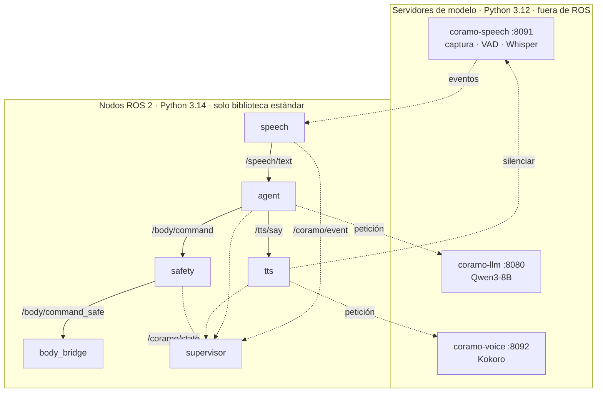
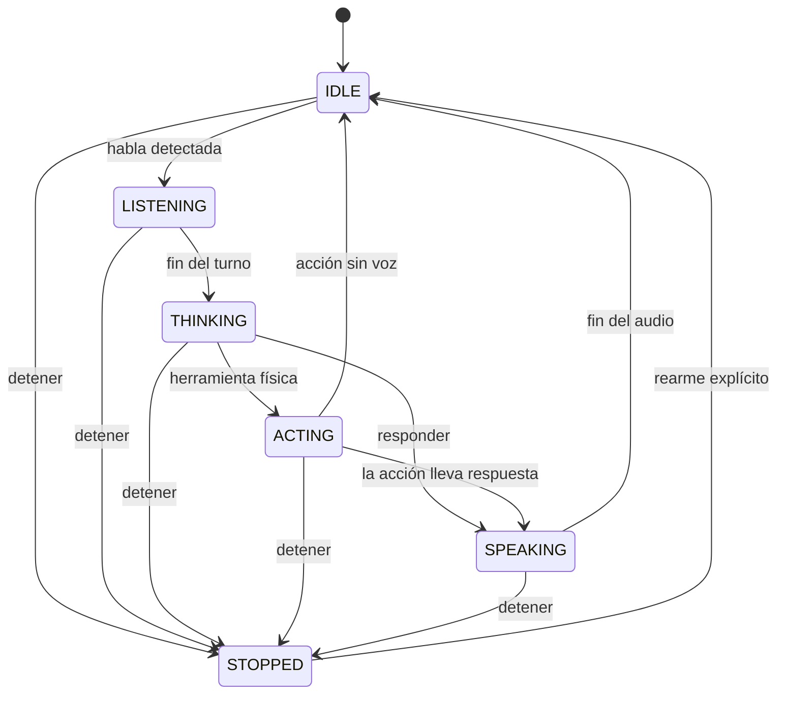
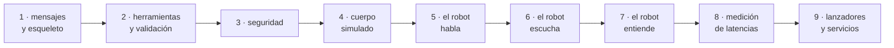

# Subproyecto A — Cerebro: diseño

Fecha: 2026-09-20
Estado: borrador para revisión de Felipe.
Deriva de: `docs/superpowers/specs/2026-09-18-coramo-v2-arquitectura-design.md` (secciones 5 y 6).

El documento maestro fija el qué. Este fija el cómo: qué procesos existen, qué se dicen entre sí, cómo se prueba y cuándo está terminado.

---

## 1. Qué construye este subproyecto

El camino completo de **voz a acción**: el robot escucha una orden hablada en español, la entiende y emite un comando validado hacia el cuerpo, o responde por voz.

Al terminar, con el cuerpo **simulado**, debe cumplirse esto:

> Alguien dice «coramo, cierra la mano» a medio metro del micrófono. En menos de 1,5 segundos desde que deja de hablar aparece en `/body/command_safe` un comando `mano` con gesto `cierra`. Si en cambio pregunta «coramo, qué hora es», el robot contesta por el parlante.

### Entra

- Captura de audio, detección de habla, transcripción, decisión con modelo de lenguaje, síntesis de voz.
- Filtro de seguridad entre la decisión y el cuerpo.
- Máquina de estados con marcas de tiempo, que es de donde salen las latencias de la tesis.
- Puente al cuerpo **simulado**, para poder desarrollar y medir sin hardware.
- Juego de pruebas que corre sin robot y sin micrófono.

### No entra

- El cuerpo real y su protocolo: eso es el subproyecto B.
- Visión y el modo cara a cara: subproyecto D.
- Calibración de cámaras, cinemática del brazo, locomoción.

---

## 2. Decisiones de este subproyecto

Tomadas con Felipe el 2026-09-20, además de las heredadas del documento maestro.

| Decisión | Elección | Consecuencia |
|---|---|---|
| Modelo de interacción | **Órdenes sueltas, sin contexto entre turnos** | El modelo de lenguaje recibe una sola frase. Más rápido, más predecible, y el acierto se mide sin ambigüedad. No entenderá «y ahora ábrela». |
| Mientras el robot habla | **Micrófono silenciado** | Elimina de raíz el bucle de auto-escucha que sufrió la v1. No se puede interrumpir por voz; la parada de verdad es el botón físico. |
| Distancia de uso | **Cerca, hasta 50 cm** | El micrófono actual da 20 dB de margen a esa distancia. Umbrales y ganancia quedan configurables por si luego se cambia el micrófono. |
| Palabra de activación | **Siempre obligatoria** en este subproyecto | El modo cara a cara depende de visión, que llega en D. |
| Backends de IA | **Locales**, por la medición del hito 0 | La nube queda como respaldo, detrás de la misma interfaz. |

---

## 3. La restricción que manda en la arquitectura

ROS 2 Lyrical corre sobre el **Python 3.14** del sistema. Ese intérprete **no tiene ruedas de `torch`**, ni de `faster-whisper`, ni de `kokoro`. Los modelos viven en entornos `uv` con **Python 3.12**.

Por lo tanto, y esto no es una preferencia sino una obligación:

> Los modelos corren como **servidores** en su propio entorno. Los nodos ROS son **clientes HTTP** que solo usan la biblioteca estándar. Ningún nodo ROS importa torch.

Esto tiene una ventaja que conviene aprovechar: la misma interfaz HTTP sirve para el backend local y para uno en la nube, así que cambiar de uno a otro es cambiar una URL en el YAML, no tocar código.

---

## 4. Procesos y qué hace cada uno



### 4.1 Servidores de modelo (Python 3.12, fuera de ROS)

| Servicio | Entorno | Puerto | Qué hace |
|---|---|---|---|
| `coramo-llm` | `~/llama.cpp` + `~/modelos` | 8080 | Ya existe del hito 0: llama-server con Qwen3-8B. Se formaliza como servicio systemd. |
| `coramo-speech` | `~/venvs/stt` | 8091 | Captura del micrófono, detección de habla y transcripción. Emite eventos. |
| `coramo-voice` | `~/venvs/tts` | 8092 | Sintetiza y reproduce por el parlante. |

**`coramo-speech`** es el que más trabajo tiene. Captura en continuo a 16 kHz, pasa cada trozo por Silero, y cuando detecta el final de un turno transcribe con faster-whisper. Expone:

- `GET /events` — flujo de eventos en formato *server-sent events*. Tipos: `speech_start`, `speech_end`, `transcript`.
- `POST /mute` y `POST /unmute` — silencia la captura mientras el robot habla.
- `GET /health` — estado y modelo cargado.

Cada transcripción guarda además el audio del turno en `~/datos/sesiones/<fecha>/<hora>.wav`. Eso alimenta gratis el juego de evaluación de la tesis.

Un evento de transcripción se ve así:

```json
{"type": "transcript", "text": "coramo cierra la mano",
 "t_speech_end": 1789950000.123, "t_emitted": 1789950000.281,
 "confidence": 0.94, "wav": "/home/coramo/datos/sesiones/2026-09-21/14-03-07.wav"}
```

`t_speech_end` es el instante en que el usuario dejó de hablar. **Todas las latencias del proyecto se miden desde ahí**, no desde que el servidor emite.

**`coramo-voice`** expone `POST /say` con el texto; sintetiza por frases y reproduce. Devuelve cuándo sonó el primer audio y cuándo terminó, para poder medir.

### 4.2 Nodos ROS (Python 3.14, solo biblioteca estándar)

| Nodo | Escucha | Publica |
|---|---|---|
| `speech` | el flujo de `coramo-speech` | `/speech/text`, `/coramo/event` |
| `agent` | `/speech/text` | `/body/command`, `/tts/say`, `/coramo/event` |
| `tts` | `/tts/say` | `/coramo/event`; llama a `coramo-voice` y silencia el micrófono mientras dura |
| `safety` | `/body/command` | `/body/command_safe`, `/coramo/event`; servicio `/body/estop` |
| `body_bridge` | `/body/command_safe` | `/joint_states`, `/body/telemetry` (**simulado** en este subproyecto) |
| `supervisor` | `/coramo/event` | `/coramo/state` |

Cada nodo es un envoltorio delgado. La lógica vive en `coramo_brain/core/`, en Python puro y sin `rclpy`, que es lo que se prueba.

### 4.3 Por qué `safety` es un nodo aparte

Podría ser una función dentro de `agent`. Es un nodo separado a propósito, por tres razones: el modelo de lenguaje nunca escribe directo al cuerpo aunque alguien se equivoque al conectar nodos; se puede probar con comandos inventados sin levantar el modelo; y en el subproyecto B se le añade la detección de pérdida de latido sin tocar el agente.

---

## 5. Contratos entre nodos

Paquete `coramo_msgs`. Se definen pocos mensajes y se definen bien, porque el subproyecto B los hereda.

```
# Transcript.msg
std_msgs/Header header
string  text
float32 confidence
builtin_interfaces/Time speech_end   # cuándo dejó de hablar el usuario
string  wav_path                     # vacío si no se guardó
```

```
# BodyCommand.msg   — una sola forma para mano, brazo y cabeza
std_msgs/Header header
string   tool          # "mano" | "brazo" | "cabeza" | "detener"
string   preset        # "cierra", "saludo", "izquierda"... vacío si van ángulos
string[] joint_names   # nombres del URDF
float64[] joint_positions_deg
builtin_interfaces/Time speech_end   # se arrastra para medir la latencia extremo a extremo
```

```
# Event.msg
std_msgs/Header header
string name     # speech_start, speech_end, transcript, wake_ok, wake_no, tool_chosen,
                # command_sent, tts_first_audio, tts_done, estop, error
string detail
```

```
# State.msg
std_msgs/Header header
string state    # IDLE, LISTENING, THINKING, ACTING, SPEAKING, STOPPED
```

Parada: servicio `/body/estop` de tipo `std_srvs/Trigger`.

Arrastrar `speech_end` dentro de `BodyCommand` puede parecer raro, pero evita tener que cruzar eventos por marcas de tiempo para calcular la latencia. La medición sale de restar dos campos del mismo mensaje.

---

## 6. Las cinco herramientas del modelo

Ya definidas en `tools/bench/tools_coramo.json` y validadas en el hito 0 con 29 aciertos de 30. Se reutiliza ese archivo tal cual; queda como fuente única en `coramo_brain/core/tools.py`.

| Herramienta | Argumentos | Qué produce |
|---|---|---|
| `mano` | `gesto` (abre, cierra, paz, ok, rock, pulgar) o `dedos` | `BodyCommand` |
| `brazo` | `pose` (reposo, saludo, extendido, arriba, abajo) o `articulaciones` | `BodyCommand` |
| `cabeza` | `mirar` (frente, izquierda, derecha, arriba, abajo) | `BodyCommand` |
| `responder` | `texto` | `/tts/say` |
| `detener` | ninguno | parada |

Reglas fijas: el modelo elige **una sola** herramienta por turno; temperatura cero; razonamiento apagado; el prompt del sistema es constante para que se mantenga en la memoria intermedia del servidor.

### La palabra «detente» no pasa por el modelo

Antes de llamar al modelo, el texto se compara contra una lista corta: detente, para, alto, quieto, no te muevas. Si coincide, se dispara la parada de inmediato y se ahorra el tiempo del modelo. Eso quita medio segundo en la única orden donde importa.

Aun así, la parada de verdad es el botón físico del subproyecto B. La voz es una comodidad, no un mecanismo de seguridad: depende de que el robot oiga bien.

---

## 7. Qué valida `safety`

Revisa todo comando antes de dejarlo pasar:

1. La herramienta existe y el gesto o la pose está en su lista.
2. Los nombres de articulación existen en `coramo_description/config/joints.yaml`.
3. Cada ángulo cae dentro de los límites de esa articulación.
4. No llegan dos comandos a menos de 100 ms uno del otro.
5. Si el estado es `STOPPED`, no pasa nada hasta que se rearme.

Si algo falla, **no recorta en silencio**: rechaza el comando, emite un evento de error y hace que el robot diga «no puedo hacer eso». Un recorte silencioso convierte una orden mal entendida en un movimiento inesperado, que es justo lo que no queremos cerca de una persona.

---

## 8. Estados y de dónde sale cada latencia



El nodo `supervisor` escucha `/coramo/event` y publica el estado. Como cada evento lleva su marca de tiempo, la tabla de latencias de la tesis se obtiene restando eventos del mismo turno, sin instrumentación aparte.

| Tramo | De qué evento a cuál | Objetivo |
|---|---|---|
| Cierre del turno | `speech_end` → `transcript` | ≤ 0,75 s |
| Decisión | `transcript` → `tool_chosen` | ≤ 0,50 s |
| Validación y envío | `tool_chosen` → `command_sent` | ≤ 0,02 s |
| **Total hasta la acción** | `speech_end` → `command_sent` | **≤ 1,5 s (p95)** |
| Hasta que se oye la respuesta | `speech_end` → `tts_first_audio` | ≤ 1,8 s |

El cierre del turno tiene dos partes que conviene no confundir. `speech_end`
marca el instante en que el usuario dejó de hablar, pero el detector todavía
espera **0,6 s de silencio** para confirmar que terminó, y solo entonces
transcribe. De esos 0,75 s, 0,6 son esa espera, que es una constante
configurable, y el resto es la transcripción. Medido el 2026-09-20: **0,72 s**.

Nota sobre el presupuesto: el documento maestro contaba 0,6 s de silencio del detector dentro del total. Aquí el silencio se mide aparte, porque es una constante configurable y no un coste de procesamiento. Con 0,6 s de silencio y estos tramos, el usuario percibe alrededor de **1,1 s**.

---

## 9. Configuración

Un archivo por perfil en `coramo_bringup/params/`. Nada de variables de entorno.

- **`xeon.yaml`** — producción. Backends locales, cuerpo real (cuando exista B).
- **`dev-sin-robot.yaml`** — cuerpo simulado. Es el perfil con el que se desarrolla.
- **`dev-sin-gpu.yaml`** — además, backends falsos que devuelven respuestas grabadas. Permite trabajar en el portátil o con el servidor apagado.

Lo que se configura, y no se toca en código: URLs de los tres servidores, tiempo de silencio para cerrar el turno, umbral de la compuerta de ruido, lista de palabras de activación, distancia máxima de coincidencia difusa, tiempos límite de cada backend, y el perfil del cuerpo.

---

## 10. Cómo se prueba

### Unitario, sin ROS y sin GPU

Cada módulo de `core/` con pytest. Lo importante:

- **Palabra de activación:** debe aceptar «coramos», «coramó», «hola coramo» y rechazar «como», «cómo», «romo». Estas variantes salen de las transcripciones reales del hito 0.
- **Interpretación de herramientas:** con salidas reales del modelo guardadas como texto, incluidas las mal formadas. El parser nunca debe lanzar una excepción: ante un JSON roto, devuelve «no entendí».
- **Validación:** ángulos fuera de rango, articulaciones inexistentes, comandos demasiado seguidos.
- **Máquina de estados:** cada transición y, sobre todo, que desde `STOPPED` no se sale sin rearme.

### De integración, sin robot

Un audio grabado entra por un backend falso de habla y se verifica que sale el `BodyCommand` correcto. Corre en cualquier máquina, sin GPU ni micrófono. Es el que debe estar verde siempre.

### De sistema, en el servidor

Con los tres servidores levantados, se reproducen las 30 órdenes del hito 0 y se mide acierto y latencia. Es el que genera la tabla de la tesis.

---

## 11. Cuándo está terminado

| Criterio | Meta | Cómo se comprueba |
|---|---|---|
| Latencia hasta la acción | ≤ 1,5 s (p95) | 30 órdenes, restando eventos |
| Acierto de herramienta | ≥ 90 % | las 30 órdenes del hito 0 |
| Falsas activaciones | 0 acciones físicas | una hora de audio ambiente |
| Auto-escucha | 0 activaciones mientras habla | 20 respuestas largas seguidas |
| Parada por voz | ≤ 1,0 s | 10 repeticiones |
| Pruebas sin robot | todas en verde | `colcon test` en cualquier máquina |
| Recuperación | el sistema sigue vivo | matar cada servidor por separado |

Ese último criterio importa: si el servidor de voz se cae, el robot debe seguir escuchando y ejecutando órdenes físicas, aunque no pueda contestar.

---

## 12. Riesgos

| Riesgo | Qué se hace |
|---|---|
| El micrófono actual no alcanza para más de medio metro | Asumido por decisión. Ganancia y umbrales configurables; si se cambia el micrófono, no se toca código. |
| Silenciar el micrófono deja un hueco donde el robot no oye | El hueco se registra como evento. Si molesta en las pruebas con personas, se evalúa cancelación de eco en una versión posterior. |
| El modelo elige `responder` cuando debía mover algo | Es el fallo observado en el hito 0 (1 de 30). Se corrige con ejemplos en el prompt, no con reglas en el código, y se vuelve a medir. |
| Un servidor de modelo se cae y el robot queda mudo o sordo | Los nodos reintentan y degradan: sin voz sigue actuando, sin modelo avisa por voz. Servicios systemd con reinicio automático. |
| Python 3.14 rompe alguna dependencia de un nodo | Los nodos solo usan biblioteca estándar. Cualquier dependencia nueva exige justificarse o irse a un servidor. |
| Las latencias empeoran cuando visión ocupe la GPU | Se vuelve a medir al integrar el subproyecto D; hay margen de VRAM y de cómputo según el hito 0. |

---

## 13. Orden de construcción




Cada paso deja algo que se puede probar solo:

1. `coramo_msgs` y el esqueleto de paquetes.
2. Herramientas y validación, con sus pruebas. Sin ROS todavía.
3. Nodo `safety` y `body_bridge` simulado: ya se puede mandar un comando a mano y verlo validado.
4. Servidor de voz y nodo `tts`: el robot ya habla.
5. Servidor de habla y nodo `speech`: el robot ya escucha y transcribe.
6. Nodo `agent` con el modelo: el camino queda cerrado punta a punta.
7. `supervisor`, eventos y medición de latencias.
8. Lanzadores, perfiles y servicios systemd.
9. Medición completa y bitácora.
